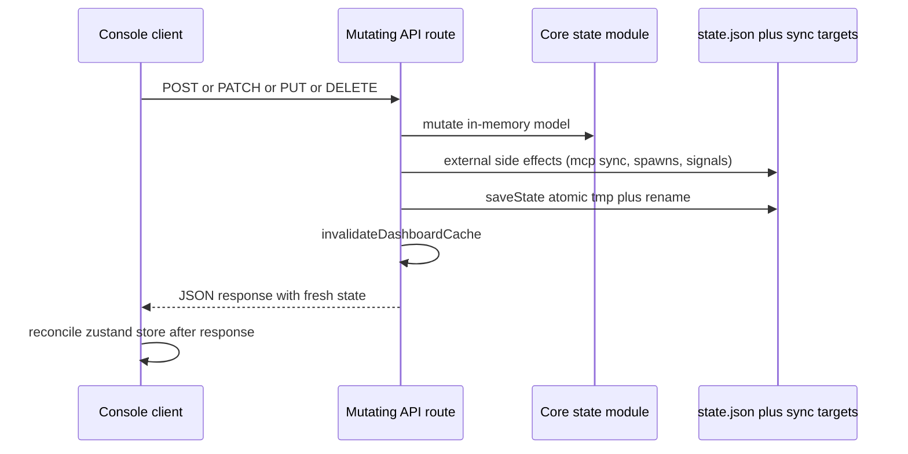
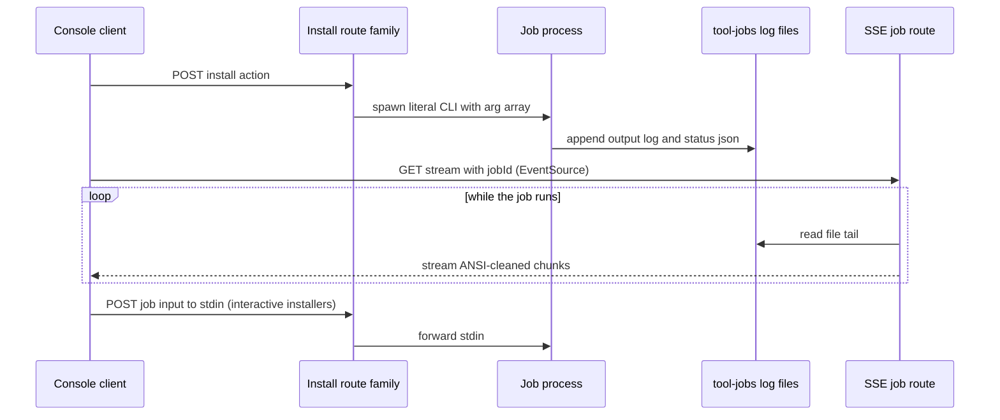

# HTTP API Route Registry

The console server is a thin shell: Next.js App Router handlers under `apps/console/src/app/api/**` delegate to the `src/core` modules (registry, state, mcp/sync, processes, skills, skillsSh/find/remove, installJobs, prompts, plugins, issues, cache, activity, sessions, memory), which in turn drive the six runtime adapters in `src/runtimes/`. Everything the UI does - probing runtimes, syncing MCP, toggling skills and plugins, managing tools, streaming installs, reading memory - flows through the routes below. This page lists every documented route grouped by domain, with its role and side-effect class.

**Markers used in the tables**

| Marker | Meaning |
|---|---|
| ✎ state | Mutates `.agents/console/state.json` or a sibling console file → must obey the file-first mutation discipline below. |
| ⚡ external | Spawns/signals processes or writes outside `state.json` (workspace builds, clones, published statics, skill installs) - not `saveState`-covered but bound by the spawn/SSRF discipline. |
| ⇶ SSE | Server-sent events stream; install-job streams read on-disk log files. |

Unmarked routes are read-only. Two nominally read routes have documented side effects and are annotated inline: `GET /api/tools` (refreshes `tools.env`, lazily lifts autostarted dashboards) and `GET /api/memory/openwiki` (re-syncs and prunes published visualizer slugs).

## Cross-cutting discipline: mutations

Every ✎ route follows the same ordering: mutate the in-memory model, run external side effects (e.g. the MCP sync across targets), persist via `saveState()` (atomic `state.json.tmp` + rename), call `invalidateDashboardCache()`, then respond; only after the response does the client reconcile its zustand store. **The client store never leads the file** - a UI cannot fabricate server state ahead of persistence. Failure semantics follow from this: a missing or broken `state.json` is not an error (reads merge onto defaults), and the 5-second dashboard micro-cache is always invalidated on mutation so post-mutation reads never serve stale data. Details: [Console State and Persistence](/openwiki/architecture/state-and-persistence.md).

*Ordering invariant shared by all ✎ routes: file first, cache invalidation second, response third, client store last.*

## Cross-cutting discipline: streaming install jobs

Long-running installs (`bunx skills add`, tool installs, repo clone) run as console jobs whose output is written to `.agents/console/tool-jobs/<id>.log` with status in the sibling `<id>.json`. The ⇶ SSE routes (`GET /api/skills-sh/install?jobId=`, `GET /api/tools/job?jobId=`) are thin streaming readers over those files, and the `POST …/input` routes forward stdin to interactive installers. Because the source of truth is a file, streams are invariant to dev-mode HMR and route-bundle boundaries - an in-memory job Map lives in whichever bundle spawned it and reads empty in a re-bundled stream route, which previously produced an endless "waiting for output" state. Mechanics: [Install Jobs and Streaming](/openwiki/workflows/install-jobs-and-streaming.md).

*Install-job streams read file logs, so they survive dev HMR and route-bundle boundaries.*

## Route-attached security properties (pointers)

Full rules and rationale live in [Security Model and Guard Boundaries](/openwiki/architecture/security-model.md); the registry only marks where they bite:

- `POST /api/workspaces/clone` - clone URLs are https-only and the target host must not be localhost or a private/reserved range (SSRF host filter).
- `GET /api/memory/file` - strict read allowlist (`core/memory.ts#checkReadPath`): markdown inside workspaces, non-hidden files under `<dir>/openwiki/` and runtime memory directories, single global files such as `~/.claude/CLAUDE.md`; realpath containment, hidden components banned, 1 MB cap. Arbitrary paths are refused.
- `GET /dashboard/*` - embed proxy whose upstream is a code literal (`127.0.0.1:8787`), GET-only, framing headers stripped from responses; no user-controlled upstream.
- Server-side fetches (`/api/skills-sh/detail`, `/api/plugins` marketplace catalogs) pass the SSRF filter: fixed allowlist (skills.sh, github.com, deepwiki.com), or public-hosts-only with private/reserved ranges banned for marketplace manifests; timeouts and response-size caps.
- Routes that launch work (`sessions/reply`, `prompts/run`, `skills/create`, `tools/action`, build routes) spawn literal commands with argument arrays and no shell; prompts are sanitized (NUL, 32 KB length cap, leading `-`); package and MCP names match strict regexes. Wrapper functions around `spawn` are banned - the Mimosa pre-commit scanner blocks them as injection patterns.

## Runtimes

| Route | Class | Role |
|---|---|---|
| `GET /api/runtimes?window=` | read | Full status snapshot of all runtimes (probe of vendor configs + FS activity signals). Served from the dashboard micro-cache: TTL 5 s plus dedup of parallel recomputes; `window` selects the activity window (1 h / 24 h / 7 d / all). |
| `PATCH /api/runtimes` | ✎ state | Selects the default runtime (★) used by prompts when a task has no assigned runtime; persists `defaultRuntime` in `state.json`. |
| `GET /api/runtimes/list` | read | Lightweight runtime list with no probing; feeds the zustand store so client UI plugins (monograms/colors) pick up newly connected runtimes automatically. |

## MCP (+ catalog)

| Route | Class | Role |
|---|---|---|
| `GET /api/mcp` | read | MCP registry snapshot plus last sync results (`state.lastMcpSync`, per-target ok/applied/removed/error). |
| `POST /api/mcp` | ✎ state | Adds a server (custom or preset) to the registry, then runs the sync across all targets. |
| `PATCH /api/mcp` | ✎ state | Accepts `enabled` (global toggle), `runtimeOverride` (per-runtime), or a wholesale `transport` replacement (stdio `command/args/env`; http `url` + per-line `headers`), then re-syncs. Other fields are untouched when only one kind of change arrives. |
| `DELETE /api/mcp` | ✎ state | Removes a server from the registry; managed-name sync then deletes it from exactly the target files the console wrote earlier - foreign entries are never touched. |
| `GET /api/mcp/catalog` | read | Preset catalog (`MCP_PRESETS`: Context7, DeepWiki, WebMCP, Playwright, plus serena/qmd/codegraph tool presets). stdio presets adapt their launcher to the selected package manager (`bunx` ↔ `npx -y`); already-installed servers are not rewritten. |

Every mutation here runs the full sync pipeline before `saveState()` - the write order is part of the contract. Semantics: [MCP Registry and Sync](/openwiki/mcp/registry-and-sync.md).

## Skills (runtime + harness)

| Route | Class | Role |
|---|---|---|
| `GET /api/skills` | read | Runtime skills with effective toggle state: `runtimeOverrides[skill][runtime] ?? defaults[skill] ?? useGlobal`. |
| `PATCH /api/skills` | ✎ state | Toggles (`useGlobal`, per-skill defaults, per-runtime overrides). All toggles are overlays in `state.json`; skill files themselves are never edited (guard boundary). |
| `GET /api/skills/installed` | read | Installed harness skills (`.agents/skills/<slug>/SKILL.md`, including skills.sh installs) with their per-skill defaults. |
| `POST /api/skills/create` | ⚡ external | Builds a creation prompt (name/summary/details/examples) and spawns a **new headless session** on the skill-creation task runtime (or ★). The skill lands in `.agents/skills/<slug>/SKILL.md` and the session appears in the common session list. |
| `POST /api/skills/remove` | ⚡ external | `bunx skills remove <name> -y` (cleans `.agents/skills/<name>`, the lock entry, agent symlinks) with a manual fallback that cleans the same locations if the CLI fails. |

## skills.sh (search / detail / install jobs)

| Route | Class | Role |
|---|---|---|
| `GET /api/skills-sh/search` | read | Shells out to `bunx skills find <query>` (primary path - the skills.sh HTTP API requires a Vercel OIDC token), parses ANSI-cleaned non-TTY output into `owner/repo@skill` install ids; search cache 60 s; an HTTP fallback supplements results when fewer than 3 hits arrive. |
| `GET /api/skills-sh/detail` | read | Description chain (cache 5 min): skills.sh registry snapshot (if `VERCEL_OIDC_TOKEN`) → `og:description` of the skill page → GitHub repo page → DeepWiki → iframe fallback; plus the security audit (Gen Agent Trust Hub, Socket, Snyk, Runlayer, ZeroLeaks). All fetches are SSRF-allowlisted - see security pointers above. |
| `POST /api/skills-sh/install` | ⚡ external, job | Spawns `bunx skills add <pkg> -y` (`DISABLE_TELEMETRY=1`, cwd = repo root) as a job: installs into `.agents/skills/<name>`, creates symlinks into detected agent directories, writes `skills-lock.json`. Preceded in the UI by a description + audit confirmation modal. |
| `GET /api/skills-sh/install?jobId=` | ⇶ SSE | Streams ANSI-cleaned install output from the on-disk job log. |
| `POST /api/skills-sh/install/input` | ⚡ external | Forwards input to the running install's stdin (interactive installers). |

## Plugins (+ marketplace)

| Route | Class | Role |
|---|---|---|
| `GET /api/plugins` | read | Installed plugins with toggle state plus catalogs (builtin + registered marketplaces, including per-catalog load errors). Marketplace manifests are fetched through the SSRF filter (http/https only, private ranges banned, 10 s timeout, 512 KB cap). |
| `POST /api/plugins` | ✎ state | Installs a plugin `{plugin:{id}}` resolved **by id from trusted catalogs** (builtin + registered marketplaces) - arbitrary plugin definitions in the request body are not accepted. Install enables the plugin: its MCP servers physically enter `state.mcp.servers` and the sync runs. |
| `PATCH /api/plugins` | ✎ state | Enable/disable. Enabling adds the plugin's MCP servers to the registry; disabling removes them **only if their transport was not edited by the user** (transport comparison protects foreign edits), then syncs. |
| `DELETE /api/plugins?id=` | ✎ state | Removes the plugin record after the disable path (servers out of the registry, sync cleans target files via managed names). Removing a server without the managed-set history would strand it in runtime configs forever. |
| `POST /api/plugins/marketplace` | ✎ state | Registers a marketplace `{name, url}` (validated name/URL, no duplicates). |
| `DELETE /api/plugins/marketplace?name=` | ✎ state | Unregisters a marketplace catalog. |

The single builtin plugin is `chrome-devtools` (MCP `chrome-devtools` = `npx -y chrome-devtools-mcp@latest`), held in `BUILTIN_PLUGINS` in `core/plugins.ts`.

## Processes

| Route | Class | Role |
|---|---|---|
| `GET /api/processes?runtime=` | read | Process list for one runtime: a single `ps axo pid,ppid,etime,pcpu,pmem,command` snapshot filtered by the adapter's `processPattern`, classified `app` (path contains `.app/`) or `cli`. Uses the shared ps-snapshot cache (TTL 2 s). |
| `POST /api/processes/action` | ⚡ external | `stop` - SIGTERM, up to 3 s grace, then SIGKILL; the PID is re-verified against a fresh ps slice before signaling (reused-PID protection). `restart` - app-only: stop + `open -a <AppName>`; CLI processes cannot be restarted (the user launches them). |

## Sessions (+ reply)

| Route | Class | Role |
|---|---|---|
| `GET /api/sessions?runtime=&dir=` | read | Session history per runtime (id, startedAt, lastActivityAt, workspaceDir, titleHint, sizeBytes, resumable) filtered by the console's workspace dirs; without a dir, all folders. Sources are per-runtime: claude/codex/zcode jsonl rollouts, kimi's `session_index.jsonl` + `state.json`; opencode/cursor SQLite stores are unread and honestly marked unsupported in the UI. |
| `GET /api/sessions?runtime=&id=` | read | Detail view: metadata plus a text preview of the transcript's first ~30 records (claude user/assistant blocks, codex user/agent messages, zcode/kimi metadata). Full data stays in the session file - only head/tail chunks are read. |
| `POST /api/sessions/reply` | ⚡ external | Replies into a waiting session via a **detached headless resume process** (cwd = session dir, 120 s timeout, output to the UI): `claude -p --resume`, `codex exec resume`, zcode via `node …/zcode.cjs -p --resume`, `kimi --session -p`, `opencode run -s`; cursor has no headless CLI and is not offered. The user's interactive session is never touched. |

The ⏳ "awaiting input" indicator that gates replies is a heuristic (turn finished + file silent ≥ 2 min + processes alive) computed by the runtime adapter.

## Prompts

| Route | Class | Role |
|---|---|---|
| `POST /api/prompts/run {prompt \| issue}` | ⚡ external | Runs a prompt in a **new** detached headless session; output goes to `.agents/console/runs/<ts>-<runtime>.log` (gitignored) and the session appears in the common session list. Runtime resolution: explicit `runtime` in the request → `settings.taskRuntimes.promptExecution` → `defaultRuntime` (★). The diagnostics **"Fix"** button builds its prompt via `core/prompts.ts#buildFixPrompt` (problem header, details, recommendation, AGENTS.md/guard compliance requirements) and goes through this same route. |

## Settings

| Route | Class | Role |
|---|---|---|
| `GET /api/settings` | read | Task-runtime assignments (`promptExecution`, `skillCreation`). |
| `PUT /api/settings` | ✎ state | Assigns a runtime (or "default" = ★, stored as `null`) per task in `state.settings.taskRuntimes`. Only runtimes known to the harness are accepted; the client store updates after the file write. |

## Tools (context-saving tools)

| Route | Class | Role |
|---|---|---|
| `GET /api/tools` | read (side effects) | Tool status matrix (system CLI / per-runtime markers / MCP registry / dashboard liveness via TCP probe) plus the selected package manager. Documented side effects: rewrites `.agents/console/tools.env` for the `tool.sh` dispatcher and lazily lifts autostarted dashboard services (retries at most once per 30 s). |
| `PUT /api/tools {packageManager}` | ✎ state | Selects Bun vs NPM; written to `.agents/console/package-manager.json` (sibling file), applied to global npm-tool installs and stdio MCP catalog presets. |
| `POST /api/tools/action` | ✎ state + ⚡ job | Lifecycle: `install` / `uninstall` / `reinstall` (uninstall+install with saved params; uninstall steps are optional and never break the chain) / `toggle` (`state.tools.installed[id].enabled`) / `init` and `reinit` (project indexing for Serena/CodeGraph/Graphify across all workspaces). `dryRun` returns the command preview without executing. Installs run as jobs (⇶ stream below); state records merge marker-detected external installs so uninstall/reinstall loses nothing. |
| `POST /api/tools/diagnose` | read | Runs the ToolDef-derived checks (CLI, dependencies, per-runtime integrations, MCP registry, dashboard TCP liveness, RTK hooks): `✓` ok, `✗` critical, `-` informational; on critical failures builds a headless fix prompt (the "Fix" button sends it to `/api/prompts/run` on the prompt-execution runtime). |
| `POST /api/tools/dashboard` | ✎ state + ⚡ external | `start` / `stop` a standalone dashboard instance (detached: `serena start-mcp-server … --enable-web-dashboard true` or `headroom proxy --port 8787`; pid in `.agents/console/dashboards.json`, log in `.agents/console/logs/<id>-dashboard.log`); `autostart {enabled}` toggles `state.tools.autostart` and immediately lifts/stops the console-owned instance. Dashboards raised by agent sessions are detected but never stopped by the console. |
| `GET /api/tools/job?jobId=` | ⇶ SSE | Streams an install job's output from its on-disk log (see streaming discipline above). |
| `POST /api/tools/job/input` | ⚡ external | Forwards stdin to a running job (interactive installers). |
| `GET /api/tools/usage` | read | Merges `.agents/console/tools-usage.json` console events (install/uninstall/toggle/build/graph/index/pm; capped at 1000) with external metric snapshots taken at most once per 5 minutes via **CLI and files only** (`rtk gain --format json --all`, `~/.headroom/proxy_savings.json`). The server never makes HTTP requests to local tool ports. |

## Workspaces (+ clone)

| Route | Class | Role |
|---|---|---|
| `GET /api/workspaces` | read | Workspace list: exactly one mandatory directory (default = repo root; replaceable, not deletable) plus additional ones (defaults `docs/`, `sources/`), with openwiki/graphify toggle state. |
| `PUT /api/workspaces` | ✎ state | Updates the list and toggles. Validation: absolute path (with `~` expansion), must exist, no duplicates. `state.workspaces.openwiki`/`.graphify` are strict subsets of the list - removed or foreign paths are pruned silently at validation. Purpose: session filtering, repo signal scope, wiki/graph build membership. |
| `GET /api/workspaces/clone` | read | Lists local projects already cloned under `sources/` (the working directory for clones; gitignored). |
| `POST /api/workspaces/clone` | ⚡ external, job | `git clone` of an https URL into `sources/<name>` as a job with terminal output; SSRF host filter (https-only, no private/reserved hosts) - see security pointers. |

## Memory

The `/memory` tab routes read everything from disk - the console keeps no memory stores of its own. The same per-runtime file list powers the per-runtime `/runtime/<id>` memory tab.

| Route | Class | Role |
|---|---|---|
| `GET /api/memory/docs` | read | Markdown trees of all workspaces, recursive (hidden dirs, `node_modules`, `.git` skipped; caps: 500 files, depth 8); auto-select README → AGENTS → first file; rendered GFM. |
| `GET /api/memory/openwiki` | read (side effects) | Per-folder wiki status: tree, `.last-update.json` marker, build status (polls every 4 s), CLI availability. Also re-synchronizes and prunes published visualizer slugs. |
| `POST /api/memory/openwiki/build` | ⚡ external | Detached build: `openwiki --init` (if `openwiki/index.md` is absent) or `--update` in the folder. Console writes `openwiki/.console-build.json` (pid/mode/started) and `.console-build.log`. |
| `GET /api/memory/graphify` | read | Per-folder graph status (`.console-build.*` metadata, published-graph presence, node/edge counts from `graph.json` with an 8 MB parse cap). |
| `POST /api/memory/graphify/build` | ⚡ external | Detached build: `graphify extract .` (first run) or `graphify update .`; metadata/log under `graphify-out/.console-build.*`. Local AST (`--code-only`), no LLM key needed. |
| `POST /api/memory/graphify/graph` | ⚡ external | Publishes `graphify-out/graph.html` to `apps/console/public/graphify/<sha256-slug12>/index.html` so the graph embeds via a same-origin iframe (vis-network loads from unpkg - viewing needs internet, building does not). |
| `GET /api/memory/runtimes?runtime=` | read | Memory files written by runtimes themselves, per workspace plus a "Global" group (claude project memory + `~/.claude/CLAUDE.md`; codex `.codex/memories/` minus its sqlite store); `?runtime=` restricts to one runtime. |
| `GET /api/memory/file?path=` | read | Reads one file through the strict allowlist (`checkReadPath`) - see security pointers above. |
| `POST /api/memory/openwiki/visualizer` | ⚡ external | Runs `openwiki visualize openwiki --export <dir>/openwiki/.visualizer` (fully local, no LLM) and publishes the fixed 5-file set (`index.html`, `client.js`, `client-lib.js`, `styles.css`, `graph.json`) into `apps/console/public/visualizers/<slug>/` (slug = sha256 of the workspace path, gitignored) for a same-origin iframe; a "stale" chip + rebuild handles wiki drift. No dynamic routes carry user paths. |

## Headroom embed proxy (`/dashboard/*`)

| Route | Class | Role |
|---|---|---|
| `GET /dashboard/*` | read (proxy) | Proxies the Headroom dashboard to defeat its `x-frame-options: DENY` so it can embed in an iframe: `/dashboard/*` → `http://127.0.0.1:8787/dashboard/*`. Upstream host/port is a code literal, requests are GET-only, and framing headers are stripped from responses. The direct URL stays available ("open in new tab"). Serena's dashboard (:24282) sets no framing header and is embedded directly, without the proxy. |

## Related pages

- [Console State and Persistence](/openwiki/architecture/state-and-persistence.md) - `state.json` schema, atomic writes, side files, the mutation ordering invariant.
- [Security Model and Guard Boundaries](/openwiki/architecture/security-model.md) - SSRF filters, `checkReadPath`, spawn discipline, guard write boundary.
- [MCP Registry and Sync](/openwiki/mcp/registry-and-sync.md) - managed-name semantics, sync targets, transport editing behind `/api/mcp`.
- [Install Jobs and Streaming](/openwiki/workflows/install-jobs-and-streaming.md) - job lifecycle, file logs, SSE routes, stdin forwarding.
