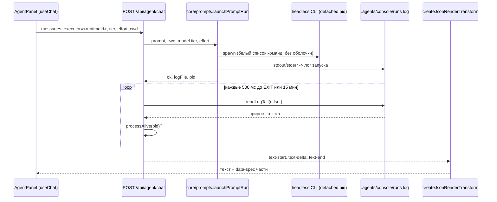

# Вкладка Агент, реестр задач и git рабочих папок

Раздел **«Агент»** (`/agent`, страница `app/agent/page.tsx`) — единый точечный вход для диалога с исполнителем по выбору пользователя: headless-CLI одного из шести рантаймов либо стриминговый ответ LLM-провайдера через AI SDK. Композер вкладки (`components/agent/AgentPanel.tsx`) содержит строку рабочей папки и ветки (`components/agent/WorkspaceBar.tsx`), поле ввода и три селектора: **исполнитель** (рантаймы и провайдеры одной группой), **модель по tier** (`fast`, `standard`, `strong`, `subagents` — те же роли, что у vendor-конфигов рантаймов) и **effort** (`low`, `medium`, `high`, `max`). Первый отправ открывает диалог над композером (FLIP-анимация transform); выполнение всегда идёт через `POST /api/agent/chat`, ответ — стрим `UIMessage` (AI SDK), который рендерится компонентом `AgentMessage`.

Списки селекторов приходят из `GET /api/workspaces` (обязательная + дополнительные папки, только существующие) и `GET /api/providers` (только активные провайдеры). Значение исполнителя `"provider"` означает провайдера по умолчанию (`resolveDefaultProvider` в `core/state.ts` — `state.defaultProvider` или `FALLBACK_PROVIDER_ID = "ollama"`); `"provider:<id>"` — конкретный активный провайдер, а любое другое значение трактуется как id рантайма из реестра адаптеров. Динамические поля (executor, tier, effort, cwd) передаются через body-функцию `DefaultChatTransport`, поэтому селекторы можно менять между репликами диалога. По первому отправу запроса `gitVersion` сбрасывается только кнопкой «Новый диалог»: статус git перечитывается при смене рабочей папки и после операций с ветками.

## Контракт POST /api/agent/chat

Маршрут (`app/api/agent/chat/route.ts`, `force-dynamic`, `maxDuration = 300` секунд) принимает JSON-тело по zod-схеме:

| Поле | Тип | Описание |
|---|---|---|
| `messages` | `UIMessage[]` (min 1) | История диалога AI SDK; каждое сообщение — `role` (`system`/`user`/`assistant`) и массив `parts` |
| `executor` | string | `"provider"`, `"provider:<id>"` или id рантайма |
| `tier` | `fast \| standard \| strong \| subagents` | Модельный tier, по умолчанию `standard` |
| `effort` | `low \| medium \| high \| max` (optional) | Уровень рассуждений; без него у рантайма действует `thinkingLevel` tier из vendor-конфига |
| `cwd` | string (optional) | Рабочая папка запуска; по умолчанию корень репозитория |
| `branch` | string (nullish) | Текущая ветка папки — попадает только в подпись задачи и системный контекст провайдера |

Невалидное тело — 400 с текстом первой проблемы zod. `cwd`, отличный от корня репозитория, обязан входить в `workspaceDirs(state)` (обязательная + дополнительные папки из `state.workspaces`), иначе — 400. Заголовок задачи — первая строка последнего user-сообщения (`taskTitle`, до 140 символов). Оба пути исполнения возвращают `createUIMessageStreamResponse`: поток текстовых частей и `data-spec` частей json-render. Преобразование `createJsonRenderTransform` (`@json-render/core`) выделяет ```spec-блоки из текста модели, поэтому один и тот же конвейер работает и для провайдера, и для рантайма; на клиенте `AgentMessage` разбирает части через `useJsonRenderMessage` и рендерит спеку каталогом `lib/json-render/registry.tsx` (компоненты Card/Heading/Text/List/Table/Metric, правила спеки в system-промте провайдера — `catalog.prompt({ mode: "inline" })`).

### Путь провайдера

Если `executor` — `"provider"` или разбирается `parseTaskProviderId`, маршрут резолвит пресет (`providerPresetById`), читает запись `readProviderEntry` и требует активного провайдера (`isActiveProvider`: проверка пройдена, ключ заполнен, если пресет его требует). Далее идут проверки: хост-политика `providerBaseUrlError` (только http/https без userinfo; онлайн-провайдерам запрещены локальные/приватные адреса и metadata-хост 169.254.169.254), пресет обязан быть OpenAI-совместимым (`verify.kind === "openai"`), у провайдера должна быть задана модель выбранного tier, а токен разрешён через `resolveProviderToken` (Bearer или обмен OAuth2-ключа на access-токен). Любая ошибка — 400 с понятным текстом.

Стриминг выполняет `streamText` (AI SDK) с моделью `createOpenAICompatible({ name: "harness-<id>", baseURL, apiKey, fetch })`; effort передаётся как `providerOptions[<name>].reasoningEffort`, причём `"max"` маппится в `"high"` (потолок OpenAI-совместимого параметра). Системный промт объединяет контекстные строки (роль ассистента консоли, рабочая папка и ветка) с промтом каталога json-render. Из истории в модель возвращаются только текстовые части — спеки прошлых ответов не пересылаются. `abortSignal` маршрута — `request.signal`: обрыв клиента отменяет запрос. Каждый провайдерский диалог регистрируется в реестре задач (`kind: "prompt"`, `executor: { type: "provider" }`, `pid: null`, лог в `.agents/console/runs/<stamp>-agent-provider-<id>.log`), в `execute` стрима накопленный текст дописывается в лог запуска, задача финализируется (`completed`/`failed` через `finishTaskMeta`), а при наличии `totalTokens > 0` запись с `source: "agent-chat"` добавляется в статистику `core/providerUsage.ts` (`appendUsageRecords`).

<!-- openwiki: mermaid parse failed and this diagram was converted to a text fence so it does not break rendering. Fix the diagram source and restore the mermaid fence. Parser error: Heuristic: an unescaped angle bracket inside a label breaks rendering; rephrase the label. -->
```text
sequenceDiagram
    participant UI as AgentPanel (useChat)
    participant API as POST /api/agent/chat
    participant REG as core/providers + providerAuth
    participant LLM as streamText (AI SDK)
    participant JSON as createJsonRenderTransform
    participant REG2 as core/tasks + providerUsage

    UI->>API: messages, executor=provider:<id>, tier, effort, cwd
    API->>API: zod bodySchema, проверка cwd в workspaceDirs
    API->>REG: пресет, readProviderEntry, isActiveProvider, providerBaseUrlError
    API->>REG: resolveProviderToken (Bearer или OAuth2-обмен)
    API->>REG2: saveTaskMeta (prompt, provider, pid null)
    API->>LLM: streamText с reasoningEffort (max -> high)
    LLM-->>JSON: текст стрима со spec-блоками
    JSON-->>UI: text parts + data-spec части
    API->>REG2: appendRunLog, finishTaskMeta, appendUsageRecords
```

*Путь провайдера: валидации пресета и хост-политики до первого байта стрима; каталог json-render превращает текст модели в UI-спеку, задача и статистика токенов закрываются по завершении стрима.*

### Путь рантайма

Любой другой `executor` трактуется как id рантайма: искомый адаптер берётся из `ctx.adapters` (реестр `ADAPTERS`). Модель выбранного tier читается из vendor-конфига (`runtimeModelForTier`, `core/prompts.ts`), effort по умолчанию — `thinkingLevel` того же tier. История UIMessage сворачивается в плоский текст `historyToPrompt` (`<роль>: <текст>`, старые реплики обрезаются первыми до 28k символов — под лимит argv в 32k `sanitizePromptArg`). Запуск делает `launchPromptRun`: headless-CLI спавнится отвязанным процессом (`detached: true`, `unref()`) с `cwd = cwd` задачи, белым списком команд (`claude -p`, `codex exec`, `kimi -p`, `opencode run`, `node <cli> -p`), моделью/effort через `headlessModelEffortArgs` (для codex `max` маппится в `high`; kimi игнорирует effort — это фиксируется в `detail` задачи) и выводом в лог `.agents/console/runs/<stamp>-<runtime>.log`. Запуск регистрируется в реестре задач (`kind: "prompt"`, `executor: { type: "runtime" }`, `sessionRuntime = runtimeId`, pid процесса).

Ответ клиенту — не stdout, а **поллинг лога задачи**: `runtimeLogChunks` каждые `RUN_POLL_MS = 500` мс дочитывает прирост файла (`readLogTail` с offset), отдаёт чанки `text-start`/`text-delta`/`text-end` и завершается, когда `processAlive(pid)` вернул false (с финальным дочитыванием хвоста) либо по таймауту `RUN_TIMEOUT_MS = 15 минут`. Тот же поток проходит через `createJsonRenderTransform`, поэтому и headless-рантайм может вернуть UI-спеку, если промт её содержит.



*Путь рантайма: отвязанный процесс живёт независимо от HTTP-запроса, а маршрут стримит прирост его лог-файла, пока процесс жив.*

## Реестр задач (.agents/console/tasks)

Все асинхронные запуски консоли — диалоги агента, промты через `POST /api/prompts/run`, сборки OpenWiki и Graphify (см. [Память, OpenWiki и вики-воркспейсы](memory-and-openwiki.md)) — регистрируются в одном реестре (`core/tasks.ts`). Каждая задача — отдельный JSON-мета-файл в `.agents/console/tasks/<id>.json`; id — штамп времени плюс случайный суффикс (`newTaskId`), запись атомарна (tmp-файл + `rename`), а `startedAt` монотонно возрастает внутри миллисекунды (`lastStartedAtMs`). Глобальных блокировок нет — задачи независимы и запускаются параллельно.

| Поле TaskMeta | Назначение |
|---|---|
| `kind` | `prompt`, `openwiki-build`, `graphify-build`, `graphify-wiki` |
| `executor` | `runtime:<id>`, `provider:<id>` или `tool:<id>` (openwiki/graphify) |
| `model` | Отображаемая модель (tier standard рантайма, модель провайдера, LLM инструмента) |
| `pid` | Процесс задачи; `null` — задача идёт в процессе консоли (запрос провайдеру) |
| `status` | `running`, `completed`, `failed`, `interrupted` |
| `sessionRuntime` | Рантайм, в списке сессий которого видна задача (`/runtime/<id>`) |
| `logFile` / `logStartOffset` | Лог-файл и его размер на момент старта: старые записи append-лога не читаются |
| `detail` | Рабочая папка, ветка, effort и т.п. |

Статусы хранятся как при старте (`running`), а **финализируются лениво при чтении списка** (`finalizeTaskStatuses`):

- задача с pid: пока `processAlive(pid)` (`kill(pid, 0)`, EPERM = «жив, но чужой») — остаётся `running`; процесс завершился — лог с момента `logStartOffset` (не более 64 КБ хвоста) проверяется паттернами `FAILURE_PATTERNS` по kind (для `prompt` — `Failed to authenticate`, `Model creation failed`, `KEY_MISSING`; для сборок — строки `error:` и специфичные тексты). Есть совпадение — `failed`, иначе `completed`;
- задача без pid (запрос провайдеру в процессе консоли): финализируется самим стримом (`finishTaskMeta`); если после рестарта сервера она «зависла» дольше `STALE_RUNNING_MS = 15 минут` — помечается `interrupted`;
- `finishTaskMeta` идемпотентна: не-running статус повторно не перезаписывается;
- меты старше 30 дней удаляются при каждом чтении (best-effort `pruneOldMetas`); повреждённые файлы пропускаются.

`GET /api/monitoring/tasks` возвращает DTO с человекочитаемым `executorLabel` (имя адаптера, `провайдер · <label>`, `инструмент · OpenWiki/Graphify`) и `sessionHref` (ссылка на `/runtime/<id>?tab=sessions` или `/memory`). Вкладка **«Мониторинг → Задачи»** (`app/monitoring/page.tsx`, `components/monitoring/TasksPanel.tsx`) опрашивает маршрут раз в 4 секунды и показывает фильтры «Активные / Все / Завершённые» с чипами статуса, вида задачи, исполнителя и модели. Покрытие — `core/__tests__/tasks.test.ts`: запись/сортировка мет, финализация по мёртвому pid (чистый лог → completed, ошибка после старта → failed, ошибка до `logStartOffset` игнорируется), живой процесс остаётся running, provider-задача старше потолка → interrupted с идемпотентной финализацией.

## Git рабочих папок

Строка над полем ввода композера (`WorkspaceBar`) связывает рабочую папку с её git-состоянием. Опрос делается маршрутами `app/api/git/*`, вся логика — в `core/git.ts` (быстрые синхронные `spawnSync` с таймаутом 8 с; каталог всегда проверяется маршрутом на вхождение в `workspaceDirs(state)` и существование):

| Маршрут | Тело/параметры | Действие |
|---|---|---|
| `GET /api/git/status?dir=…` | `dir` из рабочих папок | `gitRepoStatus`: доступность git в PATH, `rev-parse --is-inside-work-tree`, текущая ветка (`symbolic-ref --short HEAD`, `null` при detached HEAD), локальные ветки, `empty` — репозиторий без коммитов |
| `POST /api/git/init` | `{dir}` | `git init` в существующей папке; ответ — статус репозитория после инициализации |
| `POST /api/git/branch` | `{dir, name, create?}` | `create !== false`: `gitCreateBranch` (`git checkout -b`); `create: false`: `gitCheckoutBranch` (`git checkout`). Имя предварительно проверяется формой (без пробелов и ведущего `-`) и `git check-ref-format --branch` |

В UI это выглядит так: пока ответ `/api/git/status` не пришёл — индикатор «ветка: …»; папка без репозитория (или без git в PATH) — кнопка **«✕ Git»**, открывающая подтверждение `git init`; репозиторий есть — селектор веток с пометкой текущей («(текущая)», без коммитов — «(нет коммитов)») и пунктом «Создать новую ветку…» (модальное окно с вводом имени, ошибка git показывается под полем). Переключение и создание веток — через `POST /api/git/branch`; после успешной операции `onBranchChange` инкрементирует `gitVersion` в `AgentPanel`, и статус перечитывается. Выбранные папка и ветка затем уходят в `POST /api/agent/chat` (`cwd` — в запуск, `branch` — в подпись задачи и контекст провайдера), замыкая поток «выбрал папку и ветку → отправил задачу → видишь её в Мониторинге».

## Связь с остальными разделами

- [Console architecture: layers, API, data flows](overview.md) — слои консоли: вкладка Агент и маршруты `/api/agent`, `/api/git`, `/api/monitoring` — клиентская часть (`components/agent`, `components/monitoring`) и API-слой поверх `src/core`; `serverContext` даёт маршрутам `repoRoot`, `state` и реестр адаптеров;
- [Sessions, Skills and Providers](sessions-skills-providers.md) — реестр провайдеров AI SDK, `defaultProvider` и `resolveTaskRuntime`; маршрут `/api/agent/chat` — потребитель того же реестра (`providerPresetById`, `readProviderEntry`, `resolveProviderToken`);
- [Память, OpenWiki и вики-воркспейсы](memory-and-openwiki.md) — сборки OpenWiki/Graphify регистрируются тем же `saveTaskMeta` (kind `openwiki-build`/`graphify-build`/`graphify-wiki`, исполнитель `tool`), и их lazy-финализация использует те же паттерны логов; отсюда же `processAlive`;
- [Быстрый старт](../quickstart.md) — запуск консоли и первые шаги; вкладка Агент доступна из главной навигации после старта `bun run console`.
