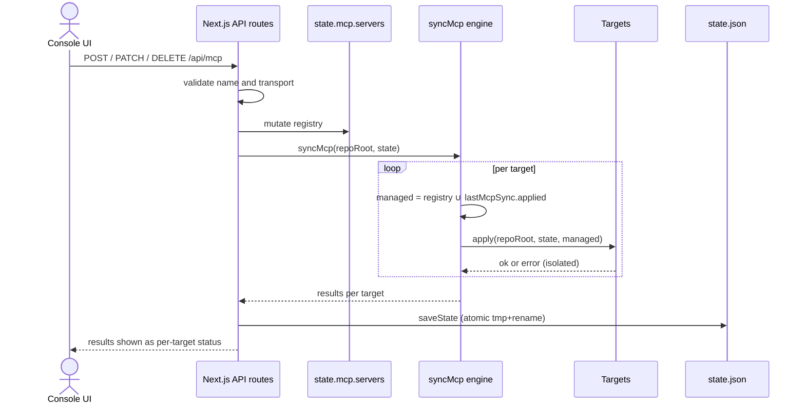

# MCP Registry and Sync to Runtime Configs

The Harness Console owns a **global MCP registry** (`state.mcp.servers`, persisted in `.agents/console/state.json` outside Git) and, after every mutation, runs a **sync engine** (`syncMcp` in `apps/console/src/core/mcp/sync.ts`) that projects the registry into the local config files of each agent runtime **in that runtime's native format**. The sync is the only writer of MCP entries managed by the console; foreign entries already present in runtime files are never touched.

## Registry state shape

Each registry entry is a `McpServerDef` (see `apps/console/src/core/types.ts`):

```ts
interface McpServerDef {
  name: string;                                  // validated identifier, see below
  transport: McpTransport;                       // stdio | http
  enabled: boolean;                              // global toggle ("initial" setting)
  runtimeOverrides?: Record<string, boolean>;    // per-runtime enablement overrides
}

type McpTransport =
  | { type: "stdio"; command: string; args?: string[]; env?: Record<string, string> }
  | { type: "http"; url: string; headers?: Record<string, string> };
```

Sync results accumulate in `state.lastMcpSync: Record<string, TargetSyncResult>`, keyed by target id, where `TargetSyncResult` records `target`, `label`, `runtimes`, `ok`, `at`, `applied`, `removed`, and an optional `error`. The state file is written atomically (tmp file + rename) after every mutation (`POST/PATCH/DELETE /api/mcp`, `/api/plugins`, `/api/tools/action` all call `syncMcp` → `saveState()` → `invalidateDashboardCache()`).

## Enablement semantics

Effective enablement of server `S` for runtime `R` is:

```
effective(R, S) = S.runtimeOverrides[R] ?? S.enabled
```

- The **project** target (`.mcp.json`) uses only the global toggle (`runtimeId === null`), i.e. it receives globally-enabled servers only.
- Each **per-runtime user config** applies the runtime's override when present, otherwise the global toggle (`desiredFor(state, runtimeId)`).
- Turning a server **off** removes it from all files but keeps the registry record, so a single toggle restores it. **Delete** removes it from the registry and from every file.

`runtimeOverrides` are edited via `PATCH /api/mcp` with `runtimeOverride: { runtime, value }`; `value: null` clears the override (falls back to the global toggle). The UI exposes the overrides as per-runtime chips on each server card (`McpPanel`) and a read-only "MCP for this runtime" view in `RuntimeSpace`.

## Name validation - a hard security boundary

Server names must satisfy `isValidMcpName`: `/^[A-Za-z0-9][A-Za-z0-9_-]{0,63}$/`. Validation is enforced in three places:

1. `POST /api/mcp` rejects invalid names with HTTP 400 before touching the registry.
2. `normalizePlugin` in `core/plugins.ts` silently drops malformed marketplace plugin contributions whose names fail the same regex.
3. `assertValidNames` inside the sync engine throws before any file or CLI write, guarding the paths where a server name becomes a TOML section header (`[mcp_servers.<name>]`), a JSON key, or a CLI argument (`claude mcp add-json <name> …`).

Because names flow into file paths, TOML headers and `spawnSync` argument lists, this regex is a shell/path-injection boundary and must not be loosened.

## Sync targets and formats

`syncMcp` iterates a fixed `targets` array. Each target declares the runtime ids it serves (`runtimes`), a `runtimeId` (`null` for the project file), and an `apply` function. ZCode and Kimi have no global MCP config format, so they are covered only by the project `.mcp.json` (listed in the project target's `runtimes`).

| Target | Location / mechanism | Format written |
|---|---|---|
| `project` | `<repo>/.mcp.json` | `{"mcpServers": {name: {type:"stdio"\|"http", command, args, env \| url, headers?}}}` |
| `claude-user` | CLI `claude mcp add-json/remove -s user`; fallback: surgical merge of `~/.claude.json` | same entry shape as project |
| `codex-global` | `~/.codex/config.toml` via the section editor in `lib/toml.ts` | `[mcp_servers.<name>]` plus `[mcp_servers.<name>.env]` subtable; http becomes `url = "…"` (headers dropped) |
| `cursor-global` | `~/.cursor/mcp.json` | same entry shape as project |
| `opencode-global` | `~/.config/opencode/opencode.jsonc` (JSONC: comments stripped before parse) | top-level key `"mcp"`; entries `type:"local"` (command/args/env) or `type:"remote"` (url only) |

Entry rendering is centralized in `stdioOrHttp(transport, kind)`:

- **http** → `{type:"http", url, ...headers}` for the `mcpServers` shape, or `{type:"remote", url}` for OpenCode (headers are not supported there, nor in Codex TOML).
- **stdio** → `{type:"stdio", command, args?, env?}` or, for OpenCode, `{type:"local", command, args?, env?}`; `args`/`env` are omitted when empty.

JSON targets (`project`, `cursor-global`, `opencode-global`, and the `~/.claude.json` fallback) all go through `mergeJsonMap`, which reads the file tolerantly (`readJsonish` returns `{}` for missing files and strips `/*…*/` and `//…` comments as a JSONC fallback), then rewrites **only** managed names inside the single top-level key and writes pretty-printed JSON back. All other keys and all foreign server entries survive untouched.

The Claude user target prefers the official CLI when `claude --version` succeeds: for each managed name it runs `claude mcp remove <name> -s user` and, if the server is desired, `claude mcp add-json <name> <json> -s user`. `spawnSync` is called with a fixed binary and an argument list (no shell); arguments containing `\n` or NUL are rejected, and a "not found" stderr on `remove` is treated as success. If the CLI is unavailable, the target falls back to `mergeJsonMap` on `~/.claude.json`.

The Codex target is string-based TOML, edited exclusively through `upsertMcpSection` / `removeMcpSection` in `apps/console/src/lib/toml.ts`. These helpers find `[mcp_servers.<name>]` and `[mcp_servers.<name>.env]` section ranges, remove them, and append a freshly serialized block at the end of the file (values serialized via `JSON.stringify`, which is valid TOML scalar/array syntax). The rest of `config.toml` - model settings, other tools' sections, comments - is preserved byte-for-byte. A stdio server without `command` raises an error during serialization.

## Managed-name ownership and garbage collection

The core invariant: **each target manages only names from the console registry** - but the managed set is slightly larger than the current registry. For every target:

```
managedNames = registryNames(state) ∪ state.lastMcpSync[target.id].applied
```

Desired names are written/updated; every other managed name is deleted from the file. The union with the previous run's `applied` list is what lets the sync remove a server that has left the registry entirely (e.g. when a plugin is disabled or uninstalled, or a tool's MCP registration is removed) - without it, such a server would linger in runtime files forever. Conversely, entries the console never wrote (a user's own servers) are outside the managed set and are never read, modified, or deleted.

Per-target results are computed before `apply` runs: `applied` = currently desired names, `removed` = managed names no longer desired. A target that has never written anything and sees an empty registry short-circuits with `ok: true` without touching the file, unless it has a recorded previous `error` (so failures stay visible and get retried). Failures are isolated per target: a throwing `apply` is caught and recorded as `{ok: false, error}` while the remaining targets still run. Sync failures surface in runtime diagnostics via `sharedIssues` in `core/issues.ts`, which turns every `lastMcpSync` entry with `ok: false` into an error-severity issue.

## Registry writer flow

Every mutation endpoint follows the same pipeline:



*Figure: registry mutation triggers a full sync across all targets, then persists results.*

Plugins (`/api/plugins`) and context-saving tools (`/api/tools/action`) write into the same registry: enabling a plugin calls `contributeMcp(state, plugin, true)` which inserts its MCP contributions; disabling removes them **only if the transport still matches** the plugin's contribution (`sameTransport`), so a user-replaced server survives plugin uninstall. Tool installs register `state.mcp.servers[tool.id]` from `def.mcpPreset(params)`; uninstall deletes that entry only if a tool record exists (externally added servers stay). All of these paths end in `syncMcp`, so registry changes always converge the files in the same request.

## Preset catalog with bun/npm adaptation

`MCP_PRESETS` in `core/plugins.ts` is the one-click install catalog (Context7, DeepWiki, WebMCP, Playwright MCP, Serena, qmd, CodeGraph), each entry carrying a ready transport and a `docsUrl`. `GET /api/mcp/catalog` serves it through `mcpPresetsForPm(pm)`, which rewrites `npx -y <pkg>` stdio presets to `bunx <pkg>` (dropping `-y`, which bun does not need) when the configured package manager is bun, leaving npm presets and http presets unchanged. The package-manager preference lives in `.agents/console/package-manager.json` and defaults to `"bun"` (see `readPackageManagerPref` in `core/tools.ts`). The `InstallMcpModal` UI fetches this catalog and installs a preset by simply POSTing its name and transport to `/api/mcp`; a custom-server form in the same modal supports http `headers` as `KEY=value` lines.

## UI surfaces

- `McpPanel` (Skills & MCP tab): registry CRUD (add form for stdio/http servers), the global toggle button, per-runtime override chips (asterisk marks an explicit override, amber tone), delete with confirmation, and the "Last sync" per-target status list rendered from `state.lastMcpSync` (`+applied`, `−removed`, errors).
- `McpSettingsModal`: edits a server's `transport` wholesale via `PATCH /api/mcp` (`enabled` and `runtimeOverrides` are untouched); parses `env`/`headers` as line-based `KEY=value` and validates the http URL scheme client-side.
- `InstallMcpModal`: preset catalog + custom server form.
- `RuntimeSpace`: read-only per-runtime MCP projection showing the effective enablement (`override ?? enabled`) and sync results filtered by the target's `runtimes` list.

## Tests

- `apps/console/src/lib/__tests__/toml.test.ts` - the TOML section editor: upsert preserves foreign sections, replaces an existing section together with its `.env` subtable, removal keeps the rest of the file, http servers serialize via `url`, removing a missing section is a no-op.
- `apps/console/src/core/__tests__/tools.test.ts` - `mcpPresetsForPm`: bun rewrites `npx -y` presets to `bunx` without `-y`, http presets pass through, npm presets stay `npx`; plus tool `mcpPreset` behavior (e.g. headroom returns a transport only in `mcp` mode).

## Invariants and operational notes

- The registry file and all synced runtime configs are local machine state; `.mcp.json` is the only synced file that lives inside the repository.
- Sync is whole-registry per run but section-scoped per write: only managed names are ever added, replaced, or removed in any target file.
- A disabled server is a registry record with `enabled: false`; it disappears from files but its transport and overrides survive.
- Plugin contributions are validated at manifest normalization time and dropped if malformed, so marketplace manifests cannot inject invalid names or transports into the registry.
- If the Claude CLI is present, `claude-user` sync mutates `~/.claude.json` only through the CLI itself; the direct file merge is a fallback for headless environments.
