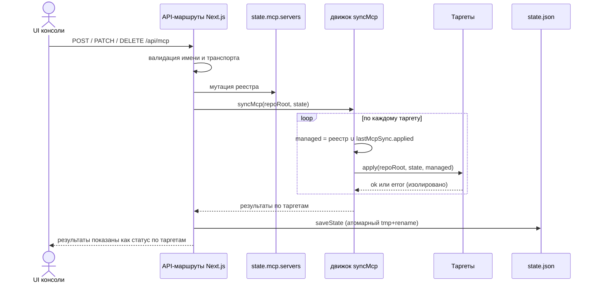

# Реестр MCP и синхронизация конфигов рантаймов

Консоль ведёт **глобальный реестр MCP** (`state.mcp.servers`, персистится в `.agents/console/state.json` вне Git) и после каждой мутации запускает **движок синка** (`syncMcp` в `apps/console/src/core/mcp/sync.ts`), который проецирует реестр в локальные конфиги каждого агентного рантайма **в нативном формате этого рантайма**. Синк — единственный писатель MCP-записей, управляемых консолью; чужие записи, уже присутствующие в файлах рантаймов, никогда не затрагиваются. Общие слои и API-маршруты консоли см. в [обзоре архитектуры](overview.md).

## Форма состояния реестра

Каждая запись реестра — `McpServerDef` (см. `apps/console/src/core/types.ts`):

```ts
interface McpServerDef {
  name: string;                                  // валидированный идентификатор, см. ниже
  transport: McpTransport;                       // stdio | http
  enabled: boolean;                              // глобальный toggle ("начальная" настройка)
  runtimeOverrides?: Record<string, boolean>;    // per-runtime override включённости
}

type McpTransport =
  | { type: "stdio"; command: string; args?: string[]; env?: Record<string, string> }
  | { type: "http"; url: string; headers?: Record<string, string> };
```

Результаты синка накапливаются в `state.lastMcpSync: Record<string, TargetSyncResult>` с ключом по id таргета, где `TargetSyncResult` содержит `target`, `label`, `runtimes`, `ok`, `at`, `applied`, `removed` и опциональный `error`. Файл состояния записывается атомарно (tmp-файл + rename) после каждой мутации (`POST/PATCH/DELETE /api/mcp`, `/api/plugins`, `/api/tools/action` — все вызывают `syncMcp` → `saveState()` → `invalidateDashboardCache()`).

## Семантика включённости

Эффективная включённость сервера `S` для рантайма `R`:

```
effective(R, S) = S.runtimeOverrides[R] ?? S.enabled
```

- **Проектный** таргет (`.mcp.json`) использует только глобальный toggle (`runtimeId === null`), т.е. получает только глобально включённые серверы.
- Каждый **пользовательский конфиг рантайма** применяет override рантайма, если он задан, иначе — глобальный toggle (`desiredFor(state, runtimeId)`).
- **Выключение** сервера удаляет его из всех файлов, но сохраняет запись в реестре, так что один toggle возвращает его обратно. **Удаление** убирает сервер и из реестра, и из всех файлов.

`runtimeOverrides` редактируются через `PATCH /api/mcp` с `runtimeOverride: { runtime, value }`; `value: null` сбрасывает override (возврат к глобальному toggle). В UI overrides показаны как per-runtime чипы на карточке сервера (`McpPanel`) и read-only представлением «MCP для этого рантайма» в `RuntimeSpace`.

## Валидация имён — жёсткая граница безопасности

Имена серверов должны удовлетворять `isValidMcpName`: `/^[A-Za-z0-9][A-Za-z0-9_-]{0,63}$/`. Валидация применяется в трёх местах:

1. `POST /api/mcp` отклоняет невалидные имена с HTTP 400 ещё до обращения к реестру.
2. `normalizePlugin` в `core/plugins.ts` молча отбрасывает некорректные MCP-вклады marketplace-плагинов, чьи имена не проходят тот же регекс.
3. `assertValidNames` внутри движка синка бросает исключение до любой записи в файл или CLI, защищая пути, где имя сервера становится заголовком TOML-секции (`[mcp_servers.<name>]`), JSON-ключом или аргументом CLI (`claude mcp add-json <name> …`).

Поскольку имена попадают в пути файлов, заголовки TOML и списки аргументов `spawnSync`, этот регекс — граница от shell- и path-инъекций, и ослаблять его нельзя.

## Таргеты синка и форматы

`syncMcp` обходит фиксированный массив `targets`. Каждый таргет объявляет id обслуживаемых рантаймов (`runtimes`), `runtimeId` (`null` для проектного файла) и функцию `apply`. У ZCode и Kimi нет глобального формата MCP-конфига, поэтому они покрываются только проектным `.mcp.json` (перечислены в `runtimes` проектного таргета).

| Таргет | Расположение / механизм | Записываемый формат |
|---|---|---|
| `project` | `<repo>/.mcp.json` | `{"mcpServers": {name: {type:"stdio"\|"http", command, args, env \| url, headers?}}}` |
| `claude-user` | CLI `claude mcp add-json/remove -s user`; fallback: хирургический мерж `~/.claude.json` | тот же формат записи, что у project |
| `codex-global` | `~/.codex/config.toml` через посекционный редактор в `lib/toml.ts` | `[mcp_servers.<name>]` плюс подтаблица `[mcp_servers.<name>.env]`; http становится `url = "…"` (headers отбрасываются) |
| `cursor-global` | `~/.cursor/mcp.json` | тот же формат записи, что у project |
| `opencode-global` | `~/.config/opencode/opencode.jsonc` (JSONC: комментарии вырезаются перед парсингом) | ключ верхнего уровня `"mcp"`; записи `type:"local"` (command/args/env) или `type:"remote"` (только url) |

Рендеринг записей централизован в `stdioOrHttp(transport, kind)`:

- **http** → `{type:"http", url, ...headers}` для формы `mcpServers` либо `{type:"remote", url}` для OpenCode (headers там не поддерживаются, как и в Codex TOML).
- **stdio** → `{type:"stdio", command, args?, env?}` либо, для OpenCode, `{type:"local", command, args?, env?}`; `args`/`env` опускаются, когда пусты.

JSON-таргеты (`project`, `cursor-global`, `opencode-global` и fallback `~/.claude.json`) идут через `mergeJsonMap`, который читает файл толерантно (`readJsonish` возвращает `{}` для отсутствующих файлов и вырезает `/*…*/`- и `//…`-комментарии как JSONC-fallback), затем переписывает **только** managed-имена внутри одного ключа верхнего уровня и записывает pretty-printed JSON обратно. Все прочие ключи и чужие серверные записи остаются нетронутыми.

Таргет Claude user предпочитает официальный CLI, когда `claude --version` успешен: для каждого managed-имени выполняется `claude mcp remove <name> -s user` и, если сервер желаем, `claude mcp add-json <name> <json> -s user`. `spawnSync` вызывается с фиксированным бинарником и списком аргументов (без shell); аргументы, содержащие `\n` или NUL, отклоняются, а stderr «not found» на `remove` трактуется как успех. Если CLI недоступен, таргет откатывается на `mergeJsonMap` по `~/.claude.json`.

Таргет Codex — строковый TOML, редактируемый исключительно через `upsertMcpSection` / `removeMcpSection` в `apps/console/src/lib/toml.ts`. Эти хелперы находят диапазоны секций `[mcp_servers.<name>]` и `[mcp_servers.<name>.env]`, удаляют их и дописывают свежесериализованный блок в конец файла (значения сериализуются через `JSON.stringify`, что является валидным TOML-синтаксисом скаляров и массивов). Остальное содержимое `config.toml` — настройки модели, секции других инструментов, комментарии — сохраняется байт-в-байт. stdio-сервер без `command` вызывает ошибку при сериализации.

## Владение managed-именами и сборка мусора

Ключевой инвариант: **каждый таргет управляет только именами из реестра консоли** — но managed-множество чуть шире текущего реестра. Для каждого таргета:

```
managedNames = registryNames(state) ∪ state.lastMcpSync[target.id].applied
```

Желаемые имена записываются/обновляются; все остальные managed-имена удаляются из файла. Именно объединение со списком `applied` прошлого прогона позволяет синку убрать сервер, полностью покинувший реестр (например, при выключении или удалении плагина либо снятии MCP-регистрации инструмента) — без этого такой сервер остался бы в файлах рантаймов навсегда. И наоборот, записи, которые консоль никогда не писала (собственные серверы пользователя), находятся вне managed-множества и никогда не читаются, не изменяются и не удаляются.

Результаты по таргетам вычисляются до запуска `apply`: `applied` = желаемые сейчас имена, `removed` = managed-имена, более не желаемые. Таргет, который ничего никогда не писал и видит пустой реестр, коротко замыкается с `ok: true`, не трогая файл, — если только у него нет записанной прошлой `error` (чтобы сбои оставались видимыми и ретраились). Ошибки изолированы по таргетам: бросивший `apply` перехватывается и записывается как `{ok: false, error}`, а остальные таргеты продолжают работать. Сбои синка всплывают в диагностике рантаймов через `sharedIssues` в `core/issues.ts`, которая превращает каждую запись `lastMcpSync` с `ok: false` в issue уровня error.

## Поток записи в реестр

Любая точка мутации проходит один и тот же конвейер:



*Рисунок: мутация реестра запускает полный синк по всем таргетам, затем результаты персистятся.*

## Плагины и инструменты как писатели реестра

Плагины (`/api/plugins`) и инструменты сохранения контекста (`/api/tools/action`) пишут в тот же реестр.

**Плагин** — это `PluginDef`: бандл «MCP-серверы + (справочные) навыки» с полем `mcp: PluginMcpContribution[]` (имя + готовый транспорт). Установка (`POST /api/plugins` → `installPlugin`) пишет плагин в `state.plugins.installed` с `enabled: true` и сразу добавляет его MCP-вклады в реестр через `contributeMcp`; `setPluginEnabled` включает/выключает вклады, `uninstallPlugin` убирает вклады и удаляет запись. Важно: запрос установки принимает только `plugin.id` — сам `PluginDef` ищется в доверенных каталогах (builtin + подключённые marketplace), а не берётся из тела запроса. Удаление вклада происходит **только если транспорт в реестре всё ещё совпадает** с вкладом плагина (`sameTransport` — строгое сравнение через `JSON.stringify`), поэтому заменённый пользователем сервер переживает удаление плагина.

**Builtin-каталог** (`BUILTIN_PLUGINS`) сейчас содержит ровно одну запись: `chrome-devtools` — stdio-сервер `npx -y chrome-devtools-mcp@latest` (диагностика страниц, performance-трейсы, консоль и сеть настоящего Chrome).

**Marketplace-манифесты** загружает `fetchMarketplacePlugins(url)` со встроенной SSRF-защитой: разрешены только http/https-протоколы; хост отклоняется, если это `localhost`, `*.local`, `0.0.0.0` или приватные/зарезервированные диапазоны (`127.*`, `10.*`, `192.168.*`, `172.16–31.*`, `169.254.*`); запрос ограничен таймаутом 10 с и лимитом ответа 512 КБ. Каждая запись манифеста прогоняется через `normalizePlugin`: id обязан соответствовать `/^[A-Za-z0-9][A-Za-z0-9._-]{0,64}$/`, а каждый MCP-вклад валидируется по `isValidMcpName`-совместимому регексу имени и структуре транспорта (stdio с непустым `command` либо http с `https?://`-URL); невалидные вклады и плагины молча отбрасываются. Списки marketplace хранятся в `state.plugins.marketplaces` и управляются через `/api/plugins/marketplace` (имя валидируется, дубликаты по имени/URL запрещены).

**Инструменты**: при установке `state.mcp.servers[tool.id]` регистрируется из `def.mcpPreset(params)`; при удалении запись из реестра убирается только если существует запись инструмента (внешне добавленные серверы не трогаются). Последовательность инструментов в реестре видна также в детекте состояния: для инструментов без собственной записи (например, serena) on/off определяется записью `state.mcp.servers` (см. [Реестр инструментов](tools-registry.md)).

Все эти пути завершаются в `syncMcp`, поэтому изменения реестра всегда сводят файлы к консистентному состоянию в том же запросе.

## Пресет-каталог с адаптацией под bun/npm

`MCP_PRESETS` в `core/plugins.ts` — каталог установки в один клик из девяти пресетов: **context7** (документация библиотек, stdio `npx -y @upstash/context7-mcp`), **deepwiki** (http `https://mcp.deepwiki.com/`), **figma** (официальный удалённый MCP Figma, http `https://mcp.figma.com/mcp`, OAuth при первом вызове), **open-design** (stdio `od mcp --daemon-url http://127.0.0.1:7456`, требует CLI `od` из desktop-приложения), **webmcp** (stdio `npx -y @jason.today/webmcp@latest --mcp`), **playwright** (stdio `npx -y @playwright/mcp@latest`), **serena** (stdio `serena start-mcp-server --context=ide --project-from-cwd`), **qmd** (stdio `qmd mcp`) и **codegraph** (stdio `codegraph serve --mcp`). Каждая запись несёт готовый транспорт и `docsUrl`.

`GET /api/mcp/catalog` отдаёт каталог через `mcpPresetsForPm(pm)`, которая переписывает stdio-пресеты вида `npx -y <pkg>` на `bunx <pkg>` (убирая `-y` — bun ставит без подтверждения и флаг не нужен), когда выбранный менеджер пакетов — bun; npm-пресеты (как и http-пресеты, и не-npx команды вроде `od`/`serena`) остаются без изменений. Предпочтение менеджера пакетов хранится в `.agents/console/package-manager.json` и по умолчанию равно `"bun"` (см. `readPackageManagerPref` в `core/tools.ts`). UI `InstallMcpModal` загружает этот каталог и устанавливает пресет простым POST его имени и транспорта в `/api/mcp`; форма кастомного сервера в той же модалке поддерживает http `headers` как построчный ввод `KEY=value`.

## UI-поверхности

- `McpPanel` (вкладка «Навыки и MCP»): CRUD реестра (форма добавления stdio/http-серверов), кнопка глобального toggle, per-runtime чипы overrides (звёздочка помечает явный override, янтарный тон), удаление с подтверждением и список статусов «Последний синк» по таргетам, рендерящийся из `state.lastMcpSync` (`+applied`, `−removed`, ошибки).
- `McpSettingsModal`: редактирует `transport` сервера целиком через `PATCH /api/mcp` (`enabled` и `runtimeOverrides` не затрагиваются); парсит `env`/`headers` построчно как `KEY=value` и валидирует схему http-URL на клиенте.
- `InstallMcpModal`: пресет-каталог + форма кастомного сервера.
- `RuntimeSpace`: read-only per-runtime проекция MCP, показывающая эффективную включённость (`override ?? enabled`) и результаты синка, отфильтрованные по списку `runtimes` таргета.

## Тесты

- `apps/console/src/lib/__tests__/toml.test.ts` — посекционный TOML-редактор: upsert сохраняет чужие секции, заменяет существующую секцию вместе с её подтаблицей `.env`, удаление сохраняет остаток файла, http-серверы сериализуются через `url`, удаление отсутствующей секции — no-op.
- `apps/console/src/core/__tests__/tools.test.ts` — `mcpPresetsForPm`: bun переписывает `npx -y` пресеты в `bunx` без `-y` (context7), http-пресеты проходят без изменений (deepwiki, figma), не-npx команды не адаптируются (open-design), при npm пресеты остаются `npx`; плюс поведение `mcpPreset` инструментов (например, headroom возвращает транспорт только в режиме `mcp`) и детект состояния инструмента по записи `state.mcp.servers` (serena).

## Инварианты и операционные замечания

- Файл реестра и все синхронизируемые конфиги рантаймов — локальное состояние машины; `.mcp.json` — единственный синкаемый файл, живущий внутри репозитория.
- Синк целостный по реестру за прогон, но посекционный по записи: в любом файле-таргете добавляются, заменяются или удаляются только managed-имена.
- Выключенный сервер — это запись реестра с `enabled: false`; он исчезает из файлов, но его транспорт и overrides сохраняются.
- Вклады плагинов валидируются на этапе нормализации манифеста и отбрасываются при малейшей некорректности, поэтому marketplace-манифесты не могут внедрить в реестр невалидные имена или транспорты.
- Если CLI Claude присутствует, синк `claude-user` мутирует `~/.claude.json` только через сам CLI; прямой мерж файла — fallback для headless-окружений.
