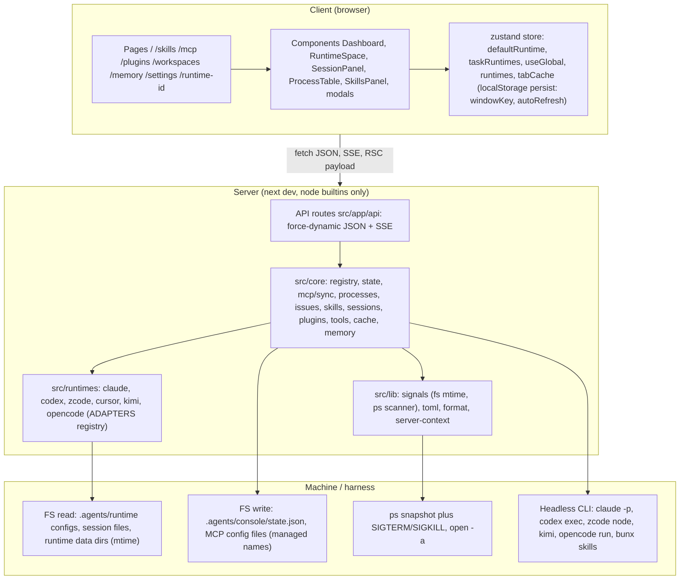

# Console architecture: layers, API, data flows

The **Agentic OS Console** (`apps/console`, package `@harness/console`) is a Next.js 15 application inside the repository's Bun workspace (`workspaces: ["apps/*"]`, root script `bun run console` → `next dev`). It manages the harness's agent runtimes (Claude Code, Codex CLI, ZCode, Cursor, Kimi Code, OpenCode) from a single dashboard: activity status, diagnostics, MCP registry + sync, skills, session history with headless replies, processes, workspaces, plugins, and context-saving tools.

**Stack contract**: Bun as package manager/runner, Next.js 15 App Router with RSC, React 19, Tailwind CSS v4, zustand (+persist) for client state, react-markdown/remark-gfm for the Memory tab. Server-side code uses **only `node:*` builtins** (`child_process`, `fs`, `os`, `path`) - no new server runtime dependencies; every interaction with the machine (probing, `ps`, spawn) goes through `src/core` modules.

## Layers and data flow

*Layered flow: pages/components/store fetch JSON or SSE from API routes, which delegate to `src/core` and the runtime adapters, which touch the filesystem, `ps`, and headless agent CLIs.*

The layering is strict in both directions:

- **Client ↔ server**: pages are server components that stream with a skeleton (`loading.tsx`) and hydrate client components with an `initial` DTO (e.g. `src/app/page.tsx` builds `buildDashboardData()` and renders `<Dashboard initial={data} />`); afterwards client components poll JSON endpoints (the dashboard refetches `/api/runtimes?window=` every 10 s when auto-refresh is on) or consume **SSE streams** for long-running install/clone jobs (`/api/skills-sh/install?jobId=`, `/api/tools/job?jobId=`).
- **Server ↔ machine**: API routes never touch the FS or spawn directly; they build a `ServerContext` via `src/lib/server-context.ts` (repoRoot + loaded state + `ADAPTERS` + `saveState()`) and call `src/core` modules. Adapters in turn never hit the filesystem directly - they receive a `ProbeContext` (`repoRoot`, `home`, `workspaces`, `fs: FsSignalHelpers`), which keeps them unit-testable with fixtures.

## Runtime discovery: two levels of modularity

1. **Source of truth for the runtime list** is `.agents/runtime/<vendor>/config.json` on disk. `loadVendorConfigs()` in `src/core/registry.ts` scans the directory, skips folders without a valid `config.json` (a directory with broken JSON is simply not a runtime), and builds the vendor card (models, capabilities, `hooksSupport`, permissions). A new vendor added to the harness appears on the dashboard automatically - the UI never hardcodes runtime lists: `GET /api/runtimes/list` feeds the client store's `runtimes[]`, and `src/plugins/runtimes/` supplies only cosmetics (monogram/color), falling back to default styling.
2. **Live-signal adapters** in `src/runtimes/<id>.ts` implement the optional `RuntimeAdapter` contract (`src/core/types.ts`): `isInstalled`, `probeSignals`, `processPattern`, `detectIssues`, `listSkills`, `listSessions`/`getSession`/`awaitingInput`, `replyCommand`, `runCommand`. The single registration point is `ADAPTERS` in `src/runtimes/index.ts`. Without an adapter a card still renders from the vendor config with status `unknown` ("no data"); a throwing adapter does not crash the dashboard (`probeError` is recorded, status becomes `unknown`).

`probeRuntimes()` probes all discovered vendors in parallel (or a single one via `only: [id]` - the `/runtime/[id]` space page uses this so it does not re-probe the other five), merges adapter signals, a `ps` process scan, shared + adapter issues, and awaiting-input heuristics, then classifies activity via the pure function `classifyActivity()` (`active-now` ≤ 5 min, `recently-active` within the selected window, `inactive` beyond; `disabled` when `isInstalled` is false). Signals are file mtimes and rollout-log headers only - session contents are read only when a preview is opened.

## Console state and the mutation invariant

Machine-local console state lives in **`.agents/console/state.json`** - outside Git (`.gitignore` covers `.agents/console/`), overridable via `HARNESS_CONSOLE_STATE` (tests). It holds the MCP registry (`mcp.servers`), skill overlays (`useGlobal`/`defaults`/`runtimeOverrides`), `defaultRuntime` (★), `settings.taskRuntimes`, plugins, workspaces (mandatory + additional + `openwiki`/`graphify`/`docs` subsets), installed tools, OpenWiki LLM settings, and `lastMcpSync` results. Neighboring service files (not state, separate formats) include `package-manager.json`, `tools.env`, `tools-usage.json`, `dashboards.json`, `tool-jobs/`, and `runs/` logs.

Persistence contract (`src/core/state.ts`):

- `loadConsoleState()` merges onto defaults - a missing or corrupt file is not an error; the console starts with defaults.
- `saveConsoleState()` writes **atomically**: `state.json.tmp` + `rename` in the same directory.
- `~`/`~/…` paths in workspaces are expanded to absolute paths at load/validation time (`expandHome`); the state only carries absolute paths. `workspaces.openwiki`/`graphify`/`docs` are validated as subsets of the folder list - paths removed from the list are silently dropped.

**Mutation ordering invariant** - every mutating API route follows the same chain:

1. mutate `ctx.state` (and run any side effects such as `syncMcp`),
2. `await ctx.saveState()` (atomic tmp+rename),
3. respond to the client,
4. the client store updates only after server confirmation,
5. `invalidateDashboardCache()`.

The canonical example is `PATCH /api/runtimes` (set ★ default runtime) and the comment in `PATCH /api/skills` states it explicitly: "мутация состояния → запись файла (saveState) → ответ клиенту (клиент обновляет store только после успешной записи)". On the client side, `src/store/console.ts` (zustand) implements the mirror rule - `setDefaultRuntime`, `saveTaskRuntimes`, `setUseGlobalSkills` all `set()` only after a successful PATCH/PUT. **The client store never leads the file.** Only UI preferences (`windowKey`, `autoRefresh`) are localStorage-persisted (`partialize`).

## Dashboard caching and performance

| Mechanism | What it does | Effect |
|---|---|---|
| Dashboard micro-cache (`src/core/cache.ts`) | TTL 5 s + inflight **dedup** of concurrent recomputes; `invalidateDashboardCache()` on every mutation | Reopens and the 10 s poll are instant; the key is `${repoRoot}\|${windowKey}` |
| Only-probe of the space page | `/runtime/[id]` probes one runtime, not all six | Runtime page ≈ 0.05 s instead of 1.7-2.5 s |
| `ps` snapshot (`src/lib/signals/processes.ts`) | One `ps axo …` per probe cycle (TTL 2 s); `verifyPidFresh` forces a fresh slice before any signal | 1 spawn instead of ~12 per probe; no killing of reused PIDs |
| `scanLimit` in FS walks (`src/lib/signals/fs.ts`) | Cap on inspected files; hidden/`node_modules`/`.next` dirs skipped | Giant dirs (`~/.cursor/extensions`) don't eat seconds |
| `tabCache` in the zustand store | Tab data (processes/skills/sessions) with TTL (default 10 s); stale cache served on network failure | Instant tab switching with background refresh |
| `loading.tsx` + streaming | Skeleton for server pages | Navigation never freezes |

The RSC page (`src/app/page.tsx`, `force-dynamic`) and `GET /api/runtimes` share the same `cachedDashboardData(key, () => buildDashboardData(...))`, so the dashboard probe is computed once per cache window across both entrypoints.

## API route registry

All routes are under `src/app/api/**/route.ts` (+ the `/dashboard/*` embed proxy), all `export const dynamic = "force-dynamic"`:

**Runtimes & dashboard**
| Route | Purpose |
|---|---|
| `GET /api/runtimes?window=` | Status snapshot of all runtimes (5 s cache, dedup) |
| `PATCH /api/runtimes` | Set the default runtime (★) |
| `GET /api/runtimes/list` | Light runtime list without probing (for the store/plugin registry) |

**MCP** (`src/core/mcp/sync.ts`)
| Route | Purpose |
|---|---|
| `GET/POST/PATCH/DELETE /api/mcp` | Registry + sync runs; PATCH takes `enabled`, `runtimeOverride`, `transport` (http transports support `headers`) |
| `GET /api/mcp/catalog` | Preset catalog (Context7, DeepWiki, WebMCP, Playwright, Serena, qmd, CodeGraph; npx presets adapt to the chosen bun/npm manager) |

**Skills** (`src/core/skills.ts`, `skillsSh.ts`, `skillRemove.ts`, `installJobs.ts`)
| Route | Purpose |
|---|---|
| `GET/PATCH /api/skills` | Runtime + harness skills with toggles (`useGlobal` / `default` / `runtime` override levels) |
| `GET /api/skills/installed` | Installed harness skills with defaults |
| `POST /api/skills/create` | Create a skill via a headless runtime session |
| `POST /api/skills/remove` | Remove (`bunx skills remove -y` + manual cleanup fallback) |
| `GET /api/skills-sh/search` | skills.sh search: CLI `find` + HTTP fallback (60 s in-memory cache) |
| `GET /api/skills-sh/detail` | Description chain (registry → skill page → GitHub → DeepWiki) + security audits |
| `POST /api/skills-sh/install` | Start `bunx skills add -y` as a job |
| `GET /api/skills-sh/install?jobId=` | SSE stream of install output (in-memory job) |
| `POST /api/skills-sh/install/input` | stdin input to the install process |

**Plugins** (`src/core/plugins.ts`)
| Route | Purpose |
|---|---|
| `GET /api/plugins` | Installed plugins + marketplace catalogs |
| `POST/PATCH/DELETE /api/plugins` | Install / enable-disable / remove a plugin (with MCP sync) |
| `POST/DELETE /api/plugins/marketplace` | Add/remove a marketplace (https manifests, host validation) |

**Sessions & prompts** (`src/core/sessions/`, `src/core/prompts.ts`)
| Route | Purpose |
|---|---|
| `GET /api/sessions?runtime=&dir=&id=` | Session list / preview detail (filtered by workspace dirs) |
| `POST /api/sessions/reply` | Headless resume reply (`claude -p --resume`, `codex exec resume`, …; 120 s timeout, capped output) |
| `POST /api/prompts/run` | Prompt into a **new** detached headless session of the task/default runtime; output → `.agents/console/runs/<ts>-<runtime>.log` |

**Processes** (`src/core/processes.ts`)
| Route | Purpose |
|---|---|
| `GET /api/processes?runtime=` | Runtime processes with uptime/cpu/mem/kind (app vs cli) |
| `POST /api/processes/action` | `stop` (SIGTERM → 3 s grace → SIGKILL) / `restart` (`.app` only, via `open -a`) - PID re-verified against a fresh `ps` slice before any signal |

**Workspaces** (`src/core/state.ts`, `src/core/toolJobs.ts`)
| Route | Purpose |
|---|---|
| `GET/PUT /api/workspaces` | Mandatory + additional folders + openwiki/graphify/docs toggles (`~` expansion, subset validation) |
| `GET/POST /api/workspaces/clone` | Local projects in `sources/`: list / `git clone` by https URL (job with SSE terminal, SSRF host filter, path-traversal guard) |

**Settings & tools** (`src/core/tools.ts`, `toolActions.ts`, `toolDiagnostics.ts`, `toolJobs.ts`, `toolsUsage.ts`, `dashboards.ts`)
| Route | Purpose |
|---|---|
| `GET/PUT /api/settings` | Per-task runtimes (`promptExecution`, `skillCreation`) |
| `GET/PUT /api/tools` | Tool statuses + `tools.env` refresh (lazy autostart) / bun-npm manager choice |
| `POST /api/tools/action` | Lifecycle: install/uninstall/reinstall/toggle (`dryRun` previews commands) |
| `POST /api/tools/diagnose` | Tool diagnostics + headless-fix prompt |
| `POST /api/tools/dashboard` | Standalone dashboard instance: start/stop, autostart toggle |
| `GET /api/tools/job?jobId=` | SSE stream of a tool job - reads the **file** log (`tool-jobs/jobs.log` + `jobs-meta.jsonl`, lines tagged `<id>\t`), invariant to HMR/route-bundle boundaries |
| `POST /api/tools/job/input` | stdin input to a job |
| `GET /api/tools/usage` | `tools-usage.json` events + external metrics |

**Memory** (`src/core/memory.ts`, `graphify.ts`, `openwikiLlm.ts`)
| Route | Purpose |
|---|---|
| `GET /api/memory/docs` | Markdown document trees of workspace folders (Docs tab) |
| `GET /api/memory/openwiki` · `POST …/build` · `GET/PUT …/llm` · `POST …/visualizer` | OpenWiki wiki status per folder, `openwiki --init/--update` runs (detached), LLM provider config, static visualizer export into `public/visualizers/<sha256-slug>` |
| `GET/POST /api/memory/graphify` · `POST …/build` · `POST …/graph` | Graphify graph status per folder (GET also republishes existing graph.html files and prunes stale slugs), usage-event logging (POST), `graphify extract/update` runs (detached), graph.html publishing into `public/graphify/<slug>` for iframe viewing |
| `GET /api/memory/runtimes?runtime=` | Runtime memory files (all or one runtime) |
| `GET /api/memory/file?path=` | Read a file from allowed memory roots only |

**Embed proxy**
| Route | Purpose |
|---|---|
| `GET /dashboard/*` | Headroom dashboard embed proxy (literal upstream `http://127.0.0.1:8787/dashboard`, GET only, strips framing headers) |

## Security and safety invariants

- **Spawn policy**: only literal commands (`bunx`, `claude`, `codex`, `kimi`, `opencode`, `node`, `open`, `sh`) with argument arrays, never a shell. Prompts are sanitized (NUL stripped, 32 kB cap, leading `-` prefixed with a space so text can't be parsed as a flag); package/MCP names pass strict regexes (`isValidMcpName`, `isValidSkillPackage`). Wrapper functions around `spawn` are deliberately **not** introduced - the Mimosa pre-commit scanner would block them; the accepted pattern is an inline `switch` over literals (`core/prompts.ts`, `core/installJobs.ts`).
- **Process actions**: `stopProcess`/`restartProcess` re-verify the PID with `verifyPidFresh()` (cache-bypassing `ps`) against the runtime's `processPattern` before signaling; restart is limited to macOS `.app` bundles.
- **SSRF filter** for server-side fetches: http/https only, hostname allowlist (`skills.sh`, `github.com`, `deepwiki.com`) for skill metadata; marketplaces and clones allow public hosts but reject localhost/private/reserved ranges; timeouts and response-size caps throughout (`core/skillsSh.ts`, workspaces/clone).
- **Memory file reads** (`GET /api/memory/file`): `checkReadPath()` enforces an allowlist of roots - `*.md` inside workspaces, non-hidden files inside `<dir>/openwiki/` and runtime memory dirs, plus single global files (`~/.claude/CLAUDE.md`) - with lexical path equality, `realpath` containment (symlinks escaping the root rejected), hidden-component rejection, and a 1 MB cap.
- **Guard policy** (AGENTS.md §3) is not weakened: the console writes only to `.agents/console/` and MCP configs (managed names from the registry), never touches skill files; secret patterns (`.env*`, `*.pem`, `id_rsa`, `secrets/`) are ignored by walkers.
- **MCP sync semantics**: each target manages the names it owns (current registry ∖ what it wrote last sync); foreign entries in files are never touched. Disabling a server removes it from files but keeps the registry record.

## Extension points

**Add a new runtime** (README, `src/runtimes/index.ts`):

1. Drop `.agents/runtime/<id>/config.json` into the harness - the dashboard card appears automatically (status "no data" until step 2).
2. Create `src/runtimes/<id>.ts` implementing `RuntimeAdapter` (`probeSignals`/`isInstalled`/`processPattern` for activity; `detectIssues`, `listSkills`, `listSessions`/`getSession`/`awaitingInput`, `replyCommand`/`runCommand` as needed) and add one line to `ADAPTERS`.
3. Optionally a UI plugin `src/plugins/runtimes/<id>.ts` (monogram/color); without it the card gets default styling, and the store picks the runtime up from `GET /api/runtimes/list`.

**Add a context-saving tool**: register a `ToolDef` in `src/core/tools.ts` (and per `AGENTS.md §10`, update `tooling/scripts/tool.sh`, `setup.sh`, and `docs/tools.md` in the same commit series). `TOOL_RUNTIMES` in `core/tools.ts` is the deliberate, documented exception to the "no hardcoded runtime lists" rule - it mirrors the harness runtime set for tool per-runtime chips and is kept in sync by the same-commit rule.

**Headless integration**: `POST /api/prompts/run` and the Diagnostics "Fix" button (`buildFixPrompt`) launch prompts in new detached sessions through the adapter's `runCommand`; replies to existing sessions use `replyCommand` (session resumes as a separate process while output returns to the UI).

## Focused tests

Tests run with `bun test` (`console:test`) over pure functions and fixtures:

- `src/core/__tests__/activity.test.ts` - `classifyActivity` boundary semantics.
- `src/core/__tests__/registry.test.ts` - `loadVendorConfigs` (skips broken configs), `probeRuntimes` (adapter-less → `unknown`/generic, disabled handling, DTO sorting).
- `src/core/__tests__/state.test.ts` - load-merge resilience, atomic save, workspace validation/subsets.
- `src/core/__tests__/memory.test.ts` - `checkReadPath` allowlist policy (realpath containment, dot components, markdown-only roots).
- `src/core/__tests__/tools.test.ts`, `toolsUsage.test.ts`, `dashboards.test.ts`, `graphify.test.ts`, `modules.test.ts`; `src/lib/__tests__/toml.test.ts` - the sectional TOML editor used for the Codex `config.toml` sync target.
