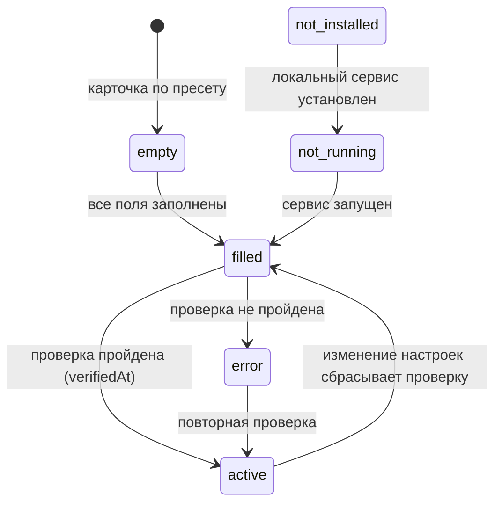

# Сессии, навыки и провайдеры

Страница описывает три соседние функции консоли: историю сессий рантаймов с headless-ответами, переключатели навыков с потоком skills.sh и реестр LLM-провайдеров. Источники: `apps/console/src/core/sessions/`, `core/skills.ts`, `core/skillsSh.ts`, `core/providers.ts` и соседние модули `provider*`. Об окружающих слоях см. [Обзор архитектуры](overview.md).

## Сессии

Консоль показывает историю сессий рантаймов из файлов на диске и сама их не хранит. Для каждого рантайма есть модуль в `core/sessions/` (`claude.ts`, `codex.ts`, `kimi.ts`, `zcode.ts`), а список отдаёт `GET /api/sessions?runtime=&dir=` (`&id=` - метаданные с текстовым превью первых реплик). Консоль читает только головные и хвостовые чанки файла и фильтрует список по рабочим папкам консоли.

| Рантайм | Источник | Привязка к папке |
|---|---|---|
| claude | `~/.claude/projects/<dashed-slug>/*.jsonl` | Слаг - путь рабочей папки (`claudeProjectSlug`) |
| codex | `~/.codex/sessions/**/rollout-*.jsonl` (и `archived_sessions`) | `cwd` из первой строки (`session_meta`) |
| kimi | `~/.kimi-code/session_index.jsonl` плюс `state.json` каждой сессии | `workDir` |
| zcode | `~/.zcode/cli/rollout/model-io-sess_*.jsonl` | Корреляция id сессии с `.zcode/plans/plan-sess_*.md` |
| opencode, cursor | Базы SQLite | Не поддерживаются; UI это отмечает |

### Ответы в сессию (headless-resume)

Флаг «ожидает ввода» - эвристика адаптера рантайма: последний ход завершён, файл не меняется минимум 2 минуты, CLI-процессы запущены. `POST /api/sessions/reply` продолжает сессию отдельным headless-процессом с таймаутом 120 с (`REPLY_TIMEOUT_MS`), поэтому интерактивная сессия пользователя не затрагивается. Команды resume берутся из `adapter.replyCommand`:

| Рантайм | Команда |
|---|---|
| claude | `claude -p --resume <sessionId> "<text>"` |
| codex | `codex exec resume <sessionId> "<text>"` |
| kimi | `kimi --session <sessionId> -p "<text>"` |
| opencode | `opencode run -s <sessionId> "<text>"` |
| zcode | `node <zcode-cli> -p --resume <sessionId> "<text>"` |
| cursor | Нет (нет headless CLI) |

### Новые запуски

`POST /api/prompts/run` запускает промт в новой отвязанной (detached) сессии рантайма задачи: вывод пишется в `.agents/console/runs/<ts>-<runtime>.log`, а запуск регистрируется в реестре задач - см. [Панель Агента, задачи и Git](agent-panel-tasks-git.md).

## Навыки

Навык - это файл `SKILL.md` с `name` и `description` во frontmatter. Консоль никогда не редактирует и не удаляет файлы навыков: все переключатели - оверлеи в `.agents/console/state.json`, реализованные в `core/skills.ts`:

```
effective(skill, runtime) =
    runtimeOverrides[skill][runtime]   // переключатель в представлении рантайма
    ?? defaults[skill]                 // per-skill значение по умолчанию
    ?? useGlobal                       // глобальный переключатель
```

Функции: `skillEffective`, `skillDefault`, `setSkillDefault`, `skillRuntimeOverride`, `setSkillRuntimeOverride`, `setUseGlobalSkills`; мутации идут через `GET/PATCH /api/skills`. `collectHarnessSkills` перечисляет навыки репозитория из `.agents/skills/<slug>/SKILL.md`.

Уровни навыков во вкладке рантайма:

| Вкладка | Источник |
|---|---|
| Runtime Skills | Собственные каталоги рантайма (например `~/.claude/skills`, `~/.codex/skills`) |
| Harness Skills | `<repo>/.agents/skills/` |
| Scripts | Агенты, плагины и промты, не являющиеся навыками |
| MCP | Серверы реестра для рантайма (см. [Реестр MCP и синхронизацию](mcp-sync.md)) |

### Поток skills.sh

<!-- openwiki: mermaid parse failed and this diagram was converted to a text fence so it does not break rendering. Fix the diagram source and restore the mermaid fence. Parser error: Heuristic: an unescaped angle bracket inside a label breaks rendering; rephrase the label. -->
```text
flowchart TD
    A["bunx skills find q"] --> B["разбор skillsFind<br/>кеш 60 с"]
    B --> C{"меньше 3 результатов?"}
    C -- да --> D["HTTP fallback<br/>skills.sh search"]
    C -- нет --> E["список до 8"]
    D --> E
    E --> F["skillDetail: цепочка"]
    F --> G["снапшот реестра"]
    F --> H["страница навыка"]
    F --> I["GitHub"]
    F --> J["DeepWiki"]
    E --> K["job: bunx skills add -y<br/>SSE-стрим"]
    K --> L[".agents/skills + симлинки<br/>skills-lock.json"]
    E --> M["bunx skills remove -y<br/>ручная зачистка"]
```

Диаграмма 1: поиск, детали и установка навыка через skills.sh.

- **Поиск**: `bunx skills find <query>`, разбор ANSI-вывода в `core/skillsFind.ts` с кешем 60 с; если найдено меньше 3 результатов - HTTP-fallback на API skills.sh (`/api/skills-sh/search` объединяет оба источника).
- **Детали**: цепочка описаний в `core/skillsSh.ts` - снапшот реестра (если есть OIDC-токен), страница навыка на skills.sh, страница репозитория GitHub, DeepWiki - плюс аудит безопасности. Исходящие запросы ограничены разрешёнными хостами (skills.sh, github.com, deepwiki.com) с таймаутами и лимитами размера; результаты и описания кешируются.
- **Установка**: `bunx skills add <pkg> -y` запускается как job в корне репозитория (`core/installJobs.ts`). Навык попадает в `.agents/skills/<name>`, симлинки - в каталоги агентов, обновляется `skills-lock.json`. Вывод стримится в UI по SSE (`POST /api/skills-sh/install`, потом `GET ?jobId=`); ввод в stdin возможен (`…/install/input`).
- **Удаление**: `bunx skills remove <name> -y`; если CLI не справился - ручная зачистка каталога, симлинков агентов и записи lock-файла в `core/skillRemove.ts`.
- **Создание**: форма собирает промт, который запускается в новой headless-сессии рантайма задачи «Создание навыка» (`/api/skills/create`) - или уходит провайдеру, если задаче назначен `provider:<id>`.

## LLM-провайдеры

Реестр провайдеров (`core/providers.ts`) ведёт LLM-провайдеров для прямых вызовов API: задачи консоли и диалог Агента, LLM-настройки OpenWiki и Graphify, экспорт окружения в LangGraph и статистика токенов. Связанные модули: `providerSettings.ts`, `providerAuth.ts`, `providerHttp.ts`, `providerLocal.ts`, `providerRun.ts`, `providerUsage.ts`.

- **Пресеты**: `PROVIDER_PRESETS` - фиксированный список онлайн-пресетов (OpenAI, Anthropic Claude, Google Gemini, DeepSeek, Moonshot Kimi, OpenRouter, Groq, xAI Grok, Together AI, Mistral AI, GigaChat, YandexGPT) и локальных (Ollama, LM Studio, vLLM). Пресет задаёт base URL, имя env-переменной ключа, механизм проверки (`openai`/`anthropic`/`gemini`) и опциональную схему `auth`. Пресет GigaChat с OAuth 2.0 обменивает ключ на короткоживущий access-токен в `core/providerAuth.ts` (кеш в памяти до истечения, повторный обмен после HTTP 401).
- **Tiers моделей**: каждый провайдер сопоставляет четыре tiers (`fast`, `standard`, `strong`, `subagents`) - те же имена, что в конфигах рантаймов (см. [Рантаймы агентов, guard и верификация](agent-runtime-and-guard.md)).
- **Файлы**: настройки живут в `.agents/providers/<id>/`: `settings.json` (версионируется), `key.env` и `ca.pem` (вне git). Результат проверки - машинное состояние в `state.json`; изменение любого файла настроек сбрасывает проверку. Запись для UI и запросов собирается из файлов и результата проверки (`readProviderEntry`).
- **Статусы**: `ProviderStatus` - один из `not-installed`, `not-running`, `empty`, `filled`, `error`, `active`. Для локальных пресетов состояние сервиса приоритетнее заполнения (`providerStatus`): не установлен бинарник - `not-installed`, сервис не отвечает - `not-running`. Провайдер становится `active` только после успешной проверки с заполненным ключом; проверка - лёгкий GET списка моделей по механизму пресета.
- **Валидация**: `providerBaseUrlError` и `onlineHostError` проверяют base URL до запроса: только http/https, без userinfo; онлайн-провайдерам запрещены локальные и приватные адреса, локальным разрешён loopback. Серверный транспорт `providerHttp` подставляет PEM-сертификат CA (цепочка НУЦ для GigaChat) и проверяет хост каждого запроса.
- **Пресеты инструментов**: `core/llmPresets.ts` задаёт отдельные списки пресетов для OpenWiki (`OPENWIKI_PRESETS`) и Graphify (`GRAPHIFY_PRESETS`); маппинг из карточки провайдера - через поле `tools` пресета. См. [Память, OpenWiki и рабочие папки](memory-and-openwiki.md).

### Провайдеры как исполнители

Активные провайдеры - не только хранилище ключей, но исполнители наряду с рантаймами:

- **Задачи консоли**: `PUT /api/settings` принимает значение `taskRuntimes` вида `provider:<id>` (только для активного провайдера - проверка `isActiveProvider` по собранной записи) и `defaultProvider` для вкладки Агент (★ на карточке; по умолчанию действует Ollama - `FALLBACK_PROVIDER_ID`). Промты тогда исполняет `core/providerRun.ts`: один запрос к API (модель tier `standard`), ответ и ошибки - в лог `.agents/console/runs/<ts>-provider-<id>.log`, задача регистрируется в реестре задач.
- **Диалог Агента**: `POST /api/agent/chat` с `executor` = `provider:<id>` (или `provider` - провайдер по умолчанию) ведёт стриминговый диалог через AI SDK (`streamText` + `createOpenAICompatible`, только OpenAI-совместимые пресеты); отдельный рантайм исполняет тот же диалог через headless-CLI - см. [Панель Агента, задачи и Git](agent-panel-tasks-git.md).
- **Экспорт в LangGraph**: `POST /api/providers {action:"export-langgraph"}` пишет активный провайдер со статическим ключом в `.agents/console/langgraph.env` (`LANGGRAPH_PROVIDER`, ключ под родной env-переменной, `OPENAI_BASE_URL`, `LANGGRAPH_MODEL_*` по tiers). OAuth-провайдеры экспорт не поддерживают (`langgraphSupported` = false): получатель .env не сможет выполнить обмен токена.
- **Статистика токенов**: `GET /api/providers/usage` отдаёт сводку из `.agents/console/provider-usage.json` (`core/providerUsage.ts`). Источники записей: `provider-run` (прямые вызовы), `agent-chat` (диалог Агента), `runtime-session`, `tool-ledger`; внешние источники собираются лениво, не чаще раза в 5 минут.

### Жизненный цикл провайдера



Диаграмма 2: статусы провайдера (`not-installed`/`not-running` только у локальных пресетов).

Провайдер доступен задачам, диалогу и экспорту только в состоянии `active`; действие `clear` удаляет файлы настроек и результат проверки, снимая привязки инструментов.
