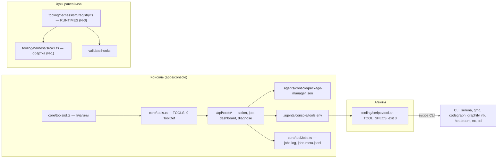

# Реестр инструментов экономии контекста

Репозиторий поставляет реестр внешних инструментов, сокращающих объём чтения контекста агентом: Serena, qmd, CodeGraph, Graphify, RTK, Headroom, OpenWiki, nx и Open Design. Реестр состоит из трёх частей: плагины инструментов в консоли, диспетчер `tool.sh` для агентов и обёртка хуков, подключающая индексы к хукам рантаймов.



Три части реестра: плагины и жизненный цикл в консоли (с файлами состояния на диске), диспетчер `tool.sh` для агентов и обёртка хуков `tooling/harness` с проверкой `validate:hooks`.

## Плагины инструментов в консоли

Каждый инструмент - один модуль `apps/console/src/core/tools/<id>.ts`, экспортирующий объект `ToolDef`. Агрегатор `apps/console/src/core/tools.ts` импортирует `serenaTool`, `qmdTool`, `codegraphTool`, `graphifyTool`, `rtkTool`, `headroomTool`, `openwikiTool`, `nxTool` и `openDesignTool` в список `TOOLS`. Там же определён `TOOL_RUNTIMES` (claude, codex, zcode, cursor, kimi, opencode) - задокументированное исключение из правила против жёстко зашитых списков рантаймов.

`ToolDef` может объявлять:

| Поле | Назначение |
|---|---|
| `id`, `title`, `description`, `docsUrl`, `category` | Данные карточки; `id` совпадает с именем MCP-сервера, если есть пресет; `category` - `code`/`graph`/`search`/`context`/`design` |
| `bin`, `systemInstall(pm, platform)`, `requires` | Детект бинаря (`which`) и системная установка выбранным менеджером (bun или npm); `systemInstall: null` - только вручную |
| `mcpPreset(params)` | MCP-транспорт, который консоль добавляет в MCP-реестр (см. [Реестр и синхронизация MCP](mcp-sync.md)) |
| `perRuntime` | Команды установки/удаления под рантайм, маркерные файлы, примечания к неподдерживаемым рантаймам, `detachedInstall` для шага-сервиса |
| `hasModes` | Установка требует выбора режима (headroom: wrap/mcp) |
| `projectInit` | Команды `init`/`reinit`/`update` для **каждой** рабочей папки (Serena, CodeGraph, Graphify); `workspaceName` строится через `graphifyWorkspaceNames`, и только Graphify его использует |
| `postInstallCommands` | Дополнительные шаги после установки (qmd: индексация рабочих папок) |
| `dashboard`, `dashboardCommand`, `uninstallStopsDashboard` | Автономный сервис и URL дашборда; uninstall такого инструмента останавливает инстанс и сбрасывает autostart |

OpenWiki (`openwikiTool`, категория `graph`) - инструмент только с системным пакетом (`globalInstallCommand(pm, "openwiki")`): в реестре отображается статус пакета, а управление сборками вынесено во вкладку «Память» (см. [Память, OpenWiki и рабочие папки](memory-and-openwiki.md)). nx (`nxTool`) - чистый CLI без per-runtime интеграций (`supported: []`), в этом репозитории вызывается внутри `verify.ts` (AGENTS.md §7).

Плагин `openDesignTool` описывает **Open Design**: дизайн-воркспейс с собственным MCP-сервером, категория `design`, бинарь `od`. Системный пакет отсутствует (`systemInstall: null`) - desktop-приложение ставится вручную; детект по `which od` может находить системную утилиту octal-dump. Per-runtime интеграция ставится собственным установщиком CLI (`od mcp install <runtime>` / `--uninstall`) для claude, codex, cursor, kimi и opencode; zcode не поддерживается (примечание в `notes`), для него и сборок kimi без команды `mcp add` сервер доступен через проектный `.mcp.json`. `mcpPreset` - stdio `od mcp --daemon-url http://127.0.0.1:7456`; тот же пресет есть в MCP-каталоге `core/plugins.ts`. Вкладка Design консоли (DesignPanel) редактирует DESIGN-токены самой консоли и к инструменту open-design отношения не имеет.

### Детект, менеджер пакетов, состояние

- **Выбор менеджера** хранится в `.agents/console/package-manager.json` (`readPackageManagerPref`: default bun, записывается атомарно через tmp+rename); `globalInstallCommand(pm, pkg)` возвращает `bun add -g <pkg>` или `npm install -g <pkg>`.
- **Детект CLI** (`detectToolCli`) - `which <bin>` с кешем на 60 с. Версия бинаря - литеральный `switch` по id (как spawn-allowlist `prompts.ts`): у openwiki флага `--version` нет, версия читается из `package.json` глобальной установки (`globalPackageVersion`: `npm root -g`, фолбэк - глобальный bun `~/.bun/install/global/node_modules`); у nx многострочный вывод `--version` разбирается по строке `Local: v…`.
- **Эффективное состояние** (`effectiveToolState`): запись консоли `state.tools.installed[id]` (`enabled`) → маркеры на диске для `perRuntime` → MCP-реестр `state.mcp.servers[id]` → `missing`. Системный пакет (`bin`) учитывается отдельно детектом CLI.

## Жизненный цикл и API

Интерфейс - «Настройки → Инструменты»: установка, удаление, переустановка, toggle, диагностика и autostart. Роуты: `/api/tools` (статусы), `/api/tools/action` (жизненный цикл; `dryRun = true` возвращает цепочку шагов без запуска - превью в модалке), `/api/tools/diagnose`, `/api/tools/dashboard`, `/api/tools/job` (SSE-стрим job'а) и `/api/tools/usage`. Установка инструмента с `mcpPreset` регистрирует сервер в MCP-реестре (`finalize` в роуте action). После мутаций перезаписывается `.agents/console/tools.env` (`writeToolsEnv`; openwiki пропускается - управляется вкладкой «Память»).

### Файловые логи job'ов

Длинные операции выполняет job-менеджер `core/toolJobs.ts` (`startToolJob`): шаги идут последовательно, без оболочки, вывод дописывается в единый файловый лог `.agents/console/tool-jobs/jobs.log` (строки с префиксом `<jobId>\t`), статус - в `jobs-meta.jsonl` (одна запись на job до первых строк и по завершении). Файловый источник **инвариантен к HMR**: в dev у каждого route-бандла своя копия модуля, и in-memory Map у SSE-роута пуста («вечное ожидание вывода») - роут `/api/tools/job` читает файлы и фильтрует по префиксу, `jobId` в путях не участвует (path-traversal исключён по построению). Лог ротируется в `jobs.log.old` при превышении 8 МБ. Шаги могут быть `optional` (неудача не обрывает цепочку) и `detached` (долгоживущий сервис: процесс отвязывается, шаг успешен сразу). Вокруг шагов установщиков codegraph/graphify/serena файлы хуков рантаймов (`.claude/settings.json`, `.codex/hooks.json`, `.cursor/hooks.json`) снапшотируются и восстанавливаются (N-5) - установщики не меняют их надолго.

### Дашборды и autostart

Дашборд живёт, только пока запущен сам инструмент (у Serena - с MCP-сервером сессии, у Headroom - с прокси). Из карточки можно запустить автономный инстанс (`POST /api/tools/dashboard {action: start}`): команда - литеральный switch по id в `core/dashboards.ts`, detached-процесс, pid в `.agents/console/dashboards.json`, лог - `.agents/console/logs/<id>-dashboard.log`. Доступность определяется TCP-пробой порта без HTTP-запроса; консоль останавливает только собственный инстанс. Тоггл `autostart` (`state.tools.autostart[id]`) запускает инстанс немедленно при включении и останавливает при выключении; далее `GET /api/tools` поддерживает сервис запущенным лениво - повторные попытки не чаще раза в 30 с. Uninstall инструмента с `uninstallStopsDashboard` (headroom) останавливает инстанс и сбрасывает autostart.

## Диспетчер tool.sh

`tooling/scripts/tool.sh` - единая точка вызова для агентов:

```
bash tooling/scripts/tool.sh status        # компактный статус всех инструментов
bash tooling/scripts/tool.sh <id> <args…>  # запуск инструмента
```

Состояние каждого инструмента читается из `.agents/console/tools.env` (строки `TOOL_<ID>=on|off`, пишет консоль). Если строки нет, скрипт сам проверяет бинарь в `PATH`. Список `TOOL_SPECS` хранит записи `id|binary|hint` для serena, qmd, codegraph, graphify, rtk, headroom, nx и open-design (бинарь `od`); openwiki в диспетчер не входит. Код выхода 0 - вывод инструмента. Код выхода 3 с `TOOL_UNAVAILABLE <id>: …` в stderr означает, что инструмент не установлен или выключен: агент работает обычным способом (grep/Read) и ничего не устанавливает без запроса пользователя. Запуск - литеральный `case` (exec по id), без выполнения переменных.

## Обёртка хуков (tooling/harness)

`tooling/harness/src/registry.ts` - единый источник списка хуков индексов (N-3). Файлы хуков рантаймов только вызывают обёртку `tooling/harness/src/cli.ts` (маркер `WRAPPER_MARKER`); прямые вызовы CLI в файлах хуков запрещены, это проверяет `validate:hooks`.

Записи хуков (ключи карты `HOOKS` в `cli.ts`):

| Хук | Событие | Матчер |
|---|---|---|
| `graphify/guard-search` | PreToolUse | `Bash\|Grep` |
| `graphify/guard-read` | PreToolUse | `Read\|Glob` |
| `serena/remind` | PreToolUse | `Read\|Grep` |
| `codegraph/prompt-hook` | UserPromptSubmit | нет |
| `serena/session-start`, `serena/session-end` | SessionStart, SessionEnd | `startup`, `resume` (у session-end без матчера) - только Claude |
| `pretooluse` | агрегатор preToolUse (`preToolUseAll`) | Cursor |

`RuntimeId` в `registry.ts` перечисляет claude, codex, zcode, cursor и kimi. Массив `RUNTIMES` держит проводку рантаймов с декларативными хуками: Claude (`.claude/settings.json`) получает полный набор, ZCode (`.zcode/config.json`) - тот же без SessionEnd, Kimi (`.kimi/config.toml`) - только три PreToolUse через `sh -c` с проверкой наличия обёртки, Cursor - один агрегатор без матчеров. Записей Codex нет, потому что `additionalContext` отклоняется, а OpenCode держит политику в плагине - правила для обоих живут в AGENTS.md; дополнительно `docsCheck` считает вызов индексного инструмента в `.codex/hooks.json` ошибкой (S-4, G-4). Команды обёртки собираются `wrapperCommand`: `command -v bun >/dev/null 2>&1 && bun "<PROJECT_DIR>/tooling/harness/src/cli.ts" <sub> || exit 0`.

CLI обёртки предоставляет также `validate` (проверка соответствия файлов реестру), `docs` / `docs --write` (проверка и приведение файлов хуков к реестру; чужие записи не трогаются) и отчёт доктора `hookBudgetReport` о бюджетах хуков. Журнал - `.agents/.tmp/hooks/hooks.log`, строка `<iso> <hook> <ms> <bytes> exit=<n>`; бюджеты (N-2): SessionStart 2 с, PreToolUse 200 мс в среднем, UserPromptSubmit 3 с и 4 КБ (см. [Рантаймы агентов, guard и верификация](agent-runtime-and-guard.md)). Инвариант N-1: хук никогда не блокирует вызов - обёртка всегда завершается с кодом 0.

## Поддержка индексов

Индексы Serena, CodeGraph и Graphify обновляются на коммите скриптом husky pre-commit `tooling/scripts/pre-commit-tools.sh`. Он работает в режиме best-effort и не блокирует коммит; `SKIP_TOOLS_UPDATE=1` отключает его. `graphify-out/` и `.codegraph/` занесены в `.gitignore`.

## Правило поддержки (AGENTS.md §10)

Изменение, начинающее использовать новый внешний инструмент, той же серией коммитов добавляет плагин `core/tools/<id>.ts` + строку в `TOOLS` и обновляет `tooling/scripts/tool.sh` (диспетчер агентов), `tooling/scripts/setup.sh` (статус и установка) и `docs/tools.md`; `docs/tools-dev.md` описывает чек-лист плагина.

## Связанные страницы

- [Рантаймы агентов, guard и верификация](agent-runtime-and-guard.md)
- [Реестр и синхронизация MCP](mcp-sync.md)
- [Память, OpenWiki и рабочие папки](memory-and-openwiki.md)
- [Обзор архитектуры](overview.md)
<!-- openwiki: broken internal link [ui-and-design-tokens.md] file "ui-and-design-tokens.md" does not exist. Fix the href or restore the target, then delete this comment. -->
- [UI и дизайн-токены](ui-and-design-tokens.md)
